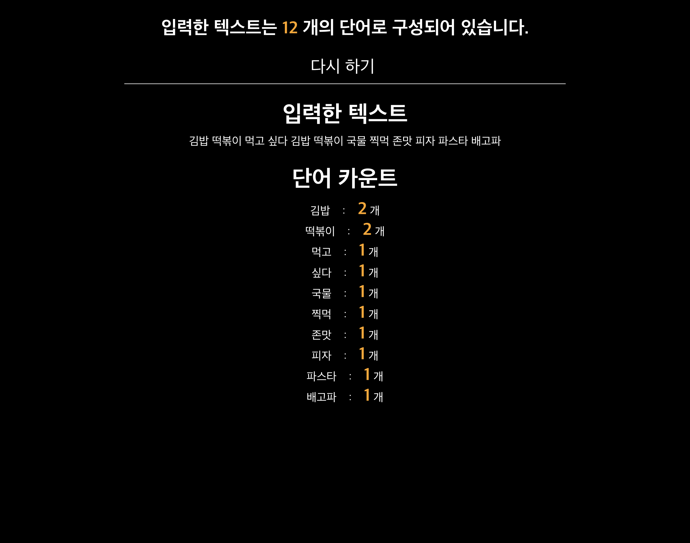
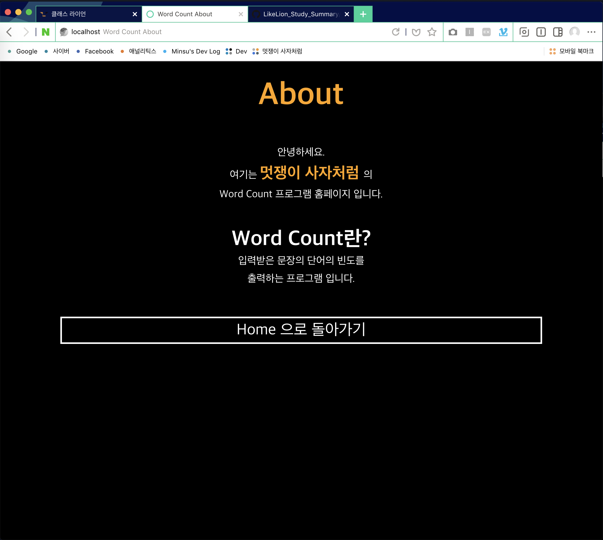

## 멋쟁이 사자처럼 7기 at 순천향대학교

## Soonchunhyang University
Department of  Computer Software Engineering
------------------------------------------

##  [김민수](https://github.com/alstn2468)
## [ [Facebook](https://www.facebook.com/profile.php?id=100003769223078) ] [ [Github](https://github.com/alstn2468) ] [ [LinkedIn](https://www.linkedin.com/in/minsu-kim-336289160/) ] [ [Blog](https://alstn2468.github.io/) ] 

운영진 스터디 요약 레파지토리입니다. 

[[Cheat Sheet]](https://github.com/LikeLionSCH/LikeLion_Study_Summary/blob/master/Summary/Cheat_Sheet.md)

### 도전! 파이썬 115제
#### 115 / 115
[[Code]](https://github.com/LikeLionSCH/LikeLion_Study_Summary/tree/master/Python_Challenge_115)

### 수업 자료
[[Week 1]](https://github.com/LikeLionSCH/LikeLion_Study_Summary/blob/master/Summary/Week_1.md) 
0주자 - 1.오리엔테이션 **[완료]** 
1주차 - 1.기본환경 셋팅 **[완료]** 
1주차 - 2.Hello World 이론 **[완료]** 
1주차 - 3.Hello World 실습 **[완료]** 
1.5주차 - MTV 패턴 **[완료]** 

 

[[Week 2]](https://github.com/LikeLionSCH/LikeLion_Study_Summary/blob/master/Summary/Week_2.md) 
2주자 - 1.wordcount 이론 **[완료]** 
2주차 - 2.wordcount 실습 part 1 **[완료]** 
2주차 - 3.wordcount 실습 part 2 **[완료]** 
2.5주차 - Git **[진행중]** 

#### [Week 2 Homework](https://github.com/LikeLionSCH/LikeLion_Study_Summary/tree/master/django_project/wordcount) 테스트 이미지

**home.html**

**result.html**

**about.html**

