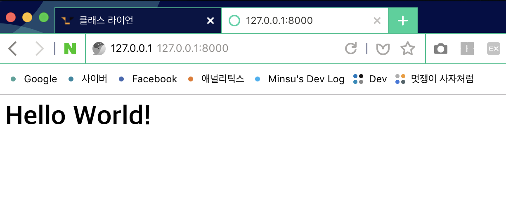

### 1주차 - 1.기본환경 셋팅

#### 사전작업
1. `git` 설치하기
2. 작업 디렉토리 만들기
3. `python` 설치 확인하기

#### VENV 생성 & 가상환경 실행
```
python -m venv myvenv(가상환경명)
```

#### 가상환경 실행하기
```
source myvenv/Scripts/activate
source myvenv/bin/activate
```

강의에서는 `Scripts`폴더의 `activate`파일을 실행하라고 하였으나<br/>
본인의 경우에 `Scripts`폴더가 존재하지 않고 `bin`폴더에 `activate`파일 존재<br/>
`source`명령어 대신 `.`을 입력해도 된다,

#### 가상환경 종료하기
```
deactivate
```

#### Django 설치하기
**가상환경을 실행하고 설치**

```
pip install django
```

<br/>

### 1주차 - 2.Hello World 이론

#### 유의사항<br/>
오늘 모든 것을 이해하려 하진 말자<br/>
(돌아왔 때 비로소 이해되는 부분들도 있다.)<br/>

#### 학습 목표<br/>
`Django`내에서의 **정보**의 흐름<br/>
여기에서 **정보**란 `HTML`파일<br/>

#### `Django`는 어떻게 작동할까?<br/>
파일 및 폴더간의 **티키타카**(상호작용)으로 작동<br/>
`Django`를 시작하기 위해선 장고 **프로젝트 생성** 필요<br/>

#### `Django`프로젝트 생성 명령어
```
django-admin startproject <project 이름>
```

#### 생성되는 파일 및 폴더 구조<br/>
manage.py<br/>
Project이름으로 된 `폴더`<br/>
├─ `__pycache__`<br/>
├─ `__init__.py`<br/>
├─ `wsig.py`<br/>
├─ `setting.py`<br/>
└─ `url.py`<br/>
※ `manage.py`파일로 서버를 돌린다.<br/>

#### `Django` 서버 작동 명령어
```
python manage.py runserver
```

#### App
프로젝트의 구성 단위<br/>
`App`폴더 안의 파일들 간의 티키타카

#### App 생성 명령어
```
python manage.py startapp <app이름>
```

#### App 폴더 구조
`App` 이름으로 된 폴더<br/>
├─ `migration` 폴더<br/>
├─ `templates` 폴더<br/>
├─ `__init.py`<br/>
├─ `admin.py`<br/>
├─ `apps.py`<br/>
├─ `models.py`<br/>
├─ `test.py`<br/>
└─ `views.py`<br/>

#### 지금 알아둬야 할 폴더와 파일 역할
**settings.py**<br/>
`app` 폴더의 위치와 설정을 저장

**templates 폴더**<br/>
사용자에게 보여질 화면(html)을 저장

**views.py**<br/>
사용자에게 보여질 화면(html)이 언제, 어떻게<br/>
처리될지 알려주는 **함수** 작성

**url.py**<br/>
작성한 html이 어떤 `url`을 입력했을 때<br/>
보여지게할지 설정

<br/>

### 1주차 - 3.Hello World 실습
#### 1. 가상 환경을 켜고 시작
```
source myvenv/bin/activate
```

#### 2. 프로젝트 생성
```
django-admin startproject <project 이름>
```
**Result**<br/>
`<project 이름>`의 폴더 생성

#### 3. 프로젝트 경로 이동
```
cd <project 이름>
```

#### 4. Django 서버 구동
```
python manage.py runserver
```
**Result**<br/>
http://127.0.0.1:8000/ 와 같은 local주소 확인 가능

서버 종료 : `ctrl` + `c`<br/>
db.sqlite3 : 데이터 베이스를 담당하는 파일<br/>

#### 5. App 생성
```
python manage.py startapp <app 이름>
```
**Result**<br/>
`<app 이름>`의 폴더 생성

#### 6. templates 폴더 생성<br/>
사용자에게 보여질 `html`파일을 담을 폴더 생성

#### 7. settings.py에 App 추가
`<project 이름>` 폴더의 `settings.py`의<br/>
`INSTALLED_APPS` 리스트에 `'myapp.apps.MyappConfig'`와<br/>
같이 `<App 이름>`의 경로 추가<br/>
필자의 `App` 이름은 `myapp`

#### 8. html파일을 처리할 함수 정의<br/>
`<App 이름>`의 폴더의 `views.py`파일에
```python
def home(request):
    return render(request, 'home.html')
```
다음과 같이 `home.html` 처리 함수 정의

#### 9. home.html의 url설계
`<project 이름>`폴더의 `urls.py` 조작

1. myapp의 `views.py`를 `urls.py`에 import
```python
import myapp.views
```

2. `urlpatterns`리스트에 `path`추가
```python
path('', myapp.views.home, name="home")
```
`path(url조건, 호출할 함수, html 이름)`<br/>
`url`의 이름은 **함수**와 **동일하게** 만들자!

최종 `urls.py`
```python
from django.contrib import admin
from django.urls import path
import myapp.views

urlpatterns = [
    path('admin/', admin.site.urls),
    path('', myapp.views.home, name="home"),
]
```

#### 10. 파일 설정 후 서버 구동 테스트<br/>


<br/>

### 1.5주차 - MTV 패턴
#### MTV란?
`Model`, `Template`, `View`의 약자<br/>

**Model**
+ `Data Base`를 다뤄주는 역할
+ 데이터 탐색 담당

**Template**
+ 사용자에게 보여지는 `html`화면
+ 보여주기 담당

**View**
+ `함수`들이 모여있는 곳
+ 처리 담당

`M`, `T`, `V` 각각 **독립적** 임무 수행으로 `Django`가 작동

#### MVC패턴
`MTV`가 차용한 방식으로 더 **일반적인** 패턴<br/>
`Model`, `View`, `Controller`의 약자

**Model**
+ `Data Base` 담당
+ `MTV`의 `Model`과 같다.

**View**
+ 사용자에게 보여지는 화면 담당
+ `MTV`의 `Template`와 같다.

**Controller**
+ 중간관리 담당
+ `MTV`의 `View`와 같다.
