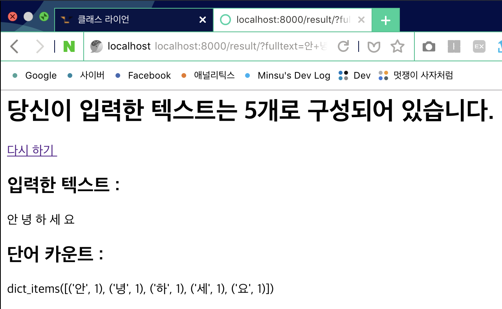
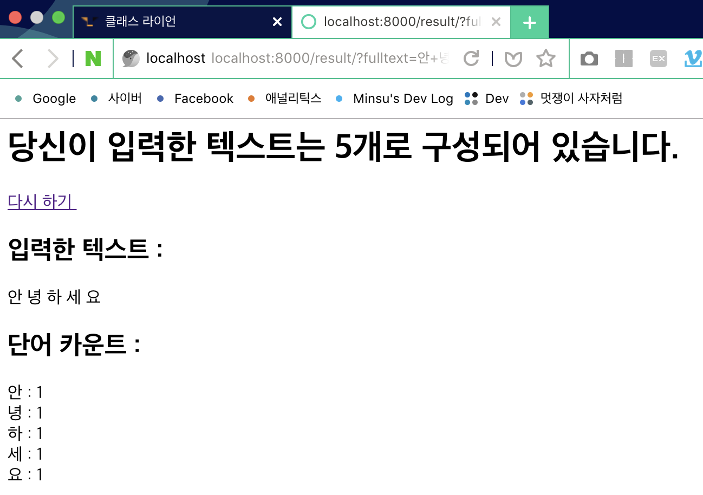

## 2주차 - 3.wordcount 실습 part 2

### 1. result.html 파일 생성

### 2. views.py 에 함수 정의
`result`함수 정의
```python
def result(request):
    return render(request, 'result.html')
```

### 3. urls.py 에 path 추가
`urlpatterns`리스트에 `result`페이지 `path`추가
```python
urlpatterns = [
    path('admin/', admin.site.urls),
    path('', wordcount.views.home, name="home"),
    path('about/', wordcount.views.about, name='about'),
    path('result/', wordcount.views.result, name='result')
]
```

### 4. result.html 과 home.html 연결
`home.html`의 `form`태그의 `action`옵션에<br/>
**템플릿 태그** 사용으로 `url`연결
```html
<form action="">
    ...
</form>
```

### 5. 제출받은 데이터 처리
`home.html`에서 `textarea`태그의 이름인 `fulltext`를<br/>
`request`의 `GET`함수로 가져와 변수에 저장
```python
text = request.GET['fulltext']
```

`render`함수의 3번째 매개변수에 저장한 데이터 전달<br/>
`render`함수의 3번째 매개변수는 **사전형** 자료형(**딕셔너리**)
```python
def result(request):
    text = request.GET['fulltext']
    return render(request, 'result.html', {
        'full': text,
    })
```

`result.html`에 **템플릿 변수**를 사용해 파이썬의 변수 사용<br/>
**템플릿 변수**의 이름은 매개변수로 준 **딕셔너리**의 **key**값
```html
<h2> 입력한 텍스트 : </h2>
{{ full }}
```

### 테스트 이미지<br/>
**입력**<br/>


**출력**<br/>


### 6. 저장한 문자열 자르기
`문자열`에서 `단어`는 **공백**을 기준<br/>
`split`함수 사용해 문자열 가공 후<br/>
`len`함수를 매개변수로 전달해 단어의 개수 전달
```python
def result(request):
    text = request.GET['fulltext']
    words = text.split()

    return render(request, 'result.html', {
        'full': text,
        'total': len(words),
    })
```
템플릿 변수를 사용해 총 단어의 개수 `result.html`에 출력
```html
<h1>당신이 입력한 텍스트는 {{ total }}개로 구성되어 있습니다.</h1>
```

**테스트 이미지**<br/>


## 7. 단어 개수 세기
**사전형 자료형** 사용<br/>
**딕셔너리**에 단어가 있는 경우 개수 **1 증가**<br/>
단어가 없는 경우 **딕셔너리**에 단어 추가<br/>
모든 데이터 처리 후 `result.html`에 **딕셔너리** 아이템 전달
```python
words_dic = {}

for word in words:
    if word in words_dic.keys():
        # Increase word count
        words_dic[word] += 1

    else:
        # Add to dictionary
        words_dic[word] = 1

return render(request, 'result.html', {
    'full': text,
    'total': len(words),
    'dictionary': words_dic.items(),
})
```

**테스트 이미지**<br/>


### 8. 단어 개수 result 페이지에 출력
**템플릿 태그** 사용<br/>
`for loop`을 사용하면서 **딕셔너리**의<br/>
`key(단어)` : `item(개수)` 형식으로 출력

```html
<h2> 단어 카운트 : </h2>

    {{ word }} : {{ count }}<br/>

```

**테스트 이미지**<br/>

