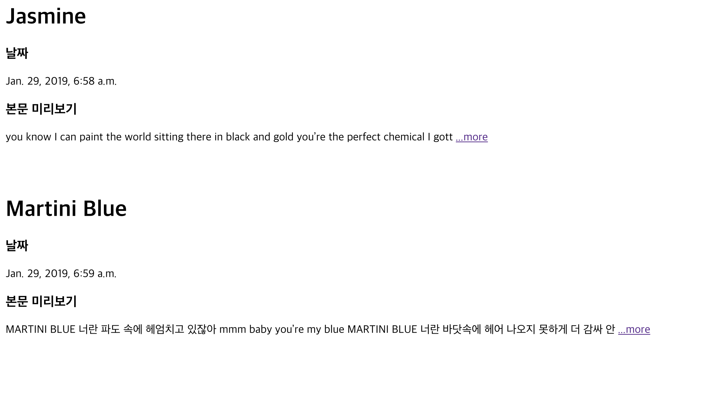
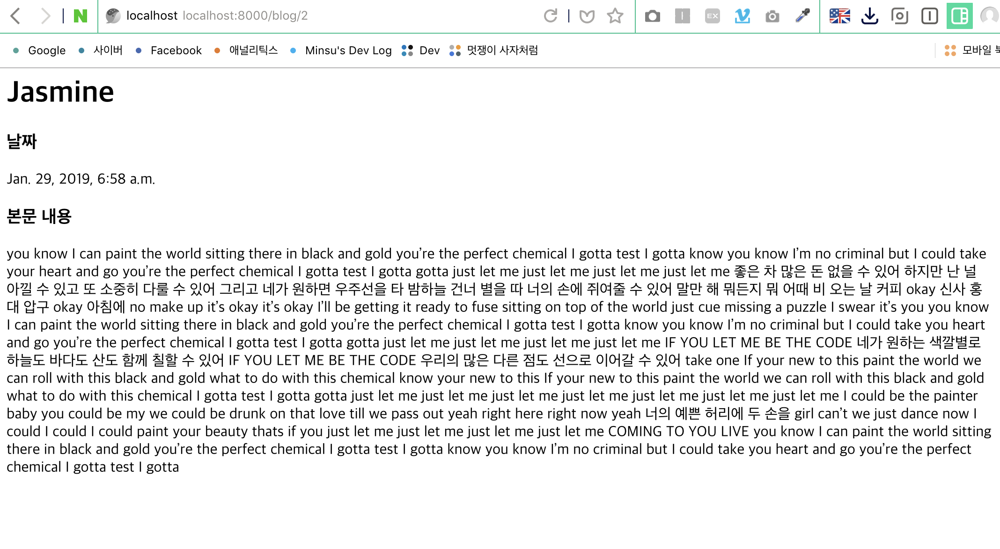
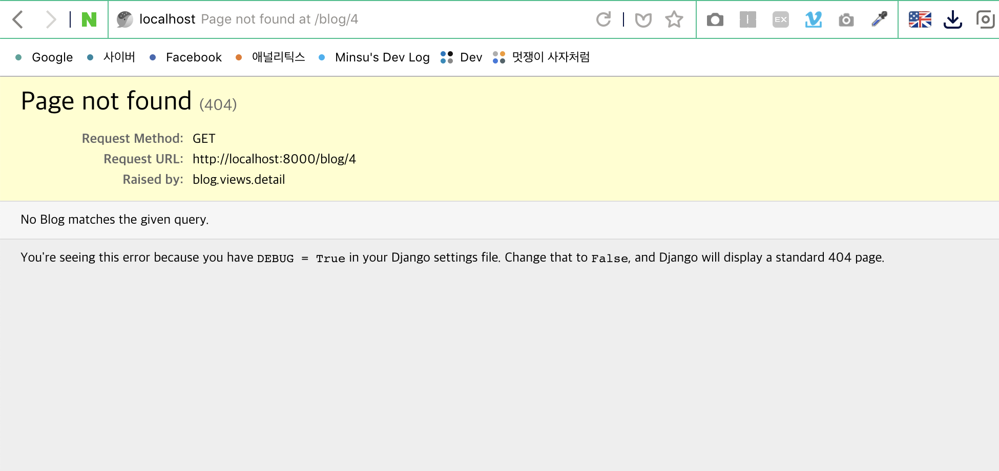
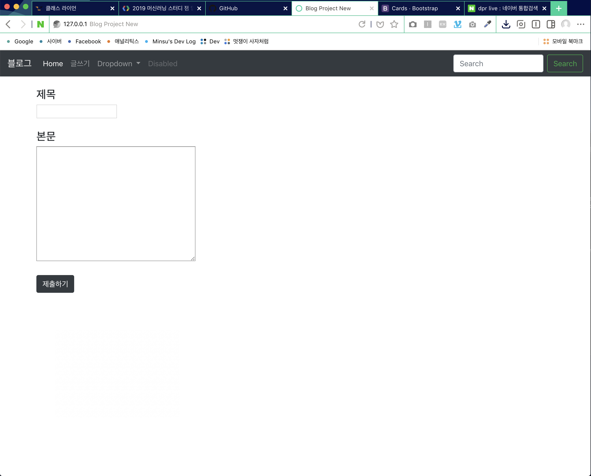
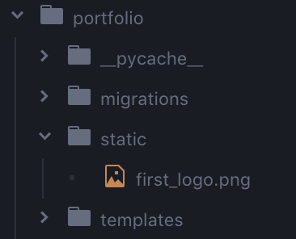
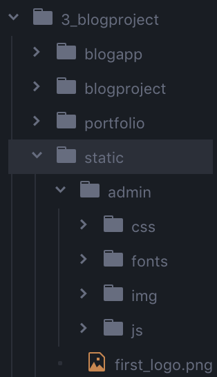
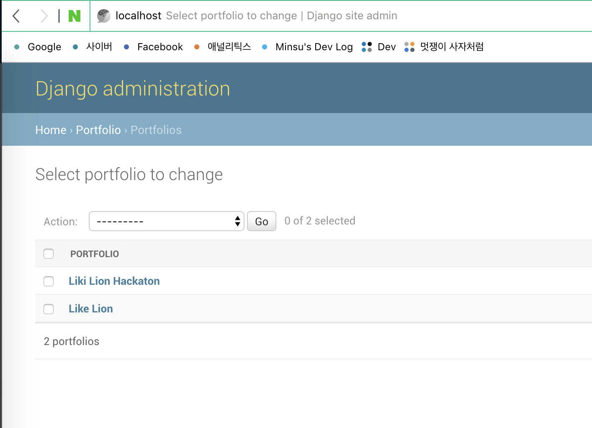

### 4주차 - 1. pk, path converter, get_object_or_404

#### 해야할 것
1. 글자 수 제한 (글자 **상한선 제시**)
2. ...more 라는 글자에 **링크 달기**
3. 링크를 클릭했을 때 `detail.html` 페이지 내보내기

#### 1. models.py에 함수 정의 하기
본문의 내용을 **100글자**로 **제한**하는 함수 정의<br/>
자신 `object`의 `body`를 **100글자**까지 반환
```python
def summary(self):
    return self.body[:100]
```

#### 2. home.html의 본문 내용 출력 변경
`blog` 객체의 `summary`함수 사용
```html

    <h1> {{ blog.title }} </h1>
    <h3> 날짜 </h3>
    <p> {{ blog.pub_date }} </p>

    <h3> 본문 미리보기 </h3>
    <p> {{ blog.summary }} </p>
    <br/>
    <br/>

```

#### 3. 세부 내용 표시 링크 추가
`a`태그 사용
```html

    <h1> {{ blog.title }} </h1>
    <h3> 날짜 </h3>
    <p> {{ blog.pub_date }} </p>

    <h3> 본문 미리보기 </h3>
    <p>
        {{ blog.summary }}
        <a href="#"> ...more </a>
    </p>
    <br/>
    <br/>

```

#### 4. 링크를 클릭했을 때 detail 페이지 내보내기
**문제점**<br/>
블로그 `object`가 매우 많아 졌을 때<br/>
어떻게 `detail.html`파일을 **생성**하고 **출력**할 것인가?

**해결법**<br/>
`detail.html`은 하나만 생성<br/>
**특정 번호**의 블로그 **객체** 내용 요청시 해당 **객체**를 출력<br/>
**url pattern = 사이트이름/blog/객체번호**<br/>
해당 번호의 **객체가 없다면** `404 ERROR` 출력<br/>

**알아야 하는 것**
1. 블로그 객체 번호 (**PK**)
2. url pattern 디자인 및 연결 (**Path Converter**)
3. 블로그 객체 미 존재 시 404 띄우기 (**Get Object or 404**)


##### 1. url 패턴 디자인하기
```python
urlpatterns = [
    path('admin/', admin.site.urls),
    path('', blog.views.home, name="home"),
    path('blog/<int:blog_id>', blog.views.detail, name="detail"),
]
```
`<int:blog_id>`이 부분이 **Path Converter**<br/>
**계층적 `url` 디자인**에 있어서 핵심 부분<br/>
`사이트이름/blog/정수`형태로 `url`을 설계<br/>
`blog_id`는 `views.py`의 함수에 전달해 주는 **인자**<br/>

**`detail.html`을 출력하는 함수의 정의**
```python
def detail(request, blog_id):
    pass
```

**`home`함수와 비교**
```python
def home(request):
    blogs = Blog.objects

    return render(request, 'home.html', {
        'blogs': blogs,
    })
```
`home`함수는 `request`만 들어오면 실행되는 함수<br/>
`request`이외의 정보는 **필요가 없기** 때문에 인자가 `request` 하나다.<br/>
하지만 `detail`함수는 `request`외에 추가 정보 필요하다.<br/>
**몇 번째 객체**를 출력할 것인지에 대한 정보 필요 따라서 **인자**에 `blog_id`추가

**Path Converter**<br/>
**여러 객체**들을 다루는, **계층적인** `url`을 자동 생성할 때 유리<br/>
`<type : 변수이름>`<br/>
타입은 `int`, `str`, `uuid` 등....

##### 2. views.py에 detail함수 작성하기
**특정 번호의 객체**를 가져와 사용해야 하기 때문에<br/>
`home`함수와 같이 `objects`메서드 사용을 하면 안된다.<br/>
따라서 `get_object_or_404(클래스, 검색 조건)`매서드를 사용<br/>

**views.py에 get_object_or_404 모듈 추가**
```python
from django.shortcuts import render, get_object_or_404
```

`pk(primary key)` : 객체들의 이름표, 구분자, 데이터의 대표값

**blog_id를 pk로 사용하여** `get_object_or_404` **함수 사용**
```python
def detail(request, blog_id):
    blog_detail = get_object_or_404(Blog, pk=blog_id)

    return render(request, 'detail.html', {
        'blog': blog_detail,
    })
```

<br/>

### 4주차 - 2. 실습과 강의 중반부 메세지
4주차 - 1. pk, path converter, get_object_or_404 강의<br/>
실습을 이어서 진행하겠습니다.

##### 3. a태그에 템플릿 태그를 사용해 링크 연결하기
`` 형식
```html
<a href=""> ...more </a>
```

**완성된 home.html 파일**
```html

    <h1> {{ blog.title }} </h1>
    <h3> 날짜 </h3>
    <p> {{ blog.pub_date }} </p>

    <h3> 본문 미리보기 </h3>
    <p>
        {{ blog.summary }}
        <a href=""> ...more </a>
    </p>
    <br/>
    <br/>

```

##### 4. detail.html 작성하기
`detail.html`에 **템플릿 태그**를 사용해 본문 내용 출력

```html
<h1> {{ blog.title }} </h1>
<h3> 날짜 </h3>
<p> {{ blog.pub_date }} </p>

<h3> 본문 내용 </h3>
<p>
    {{ blog.body }}
</p>
```

#### 결과 화면
**home.html**<br/>


**detail.html**<br/>


**404 Not Found**<br/>


#### 추가 내용
1. **복습을 합시다!**
2. **오류와 에러는 성장 가능성이다!**
    - **답답해하지 말자!**
    - **당당해지자!**
    - **질문 하자!**

<br/>

### 4주차 - 3. blog project 1
**복습 겸 뼈대 만들기 진행중**

기존의 내용을 복습하는 강의이기 때문에<br/>
따로 요약 정리하지 않겠습니다.

<br/>

### 4주차 - 4. blog project 2

#### 해야할 것
1. Navbar에 글쓰기 항목 만들기
2. 글쓰기 항목에 `url` 연결하기
3. 데이터 입력 공간 생성 및 제출 버튼 기능 구현(`views.py`)하기
    + `request`가 들어오면 `new.html`을 띄우는 함수
    + `new.html`에서 입력한 내용을 `DB`에 등록하는 함수

#### 1. new.html 구성
다음과 같이 `new.html`을 구성
```html
<div class="container">
    <form action="">
        <h4>제목</h4>
        <input type="text" name="title">
        <br><br>

        <h4>본문</h4>
        <textarea name="body" rows="10" cols="40"></textarea>
        <br><br>

        <input type="submit" class="btn btn-dark" value="제출하기">
    </form>
</div>
```

#### 2. new 함수 구현 및 url 연결
**views.py**
```python
def new(request):
    return render(request, "new.html")
```

**urls.py**
```python
urlpatterns = [
    path('admin/', admin.site.urls),
    path('', blogapp.views.home, name="home"),
    path('blog/<int:blog_id>', blogapp.views.detail, name="detail"),
    path('blog/new', blogapp.views.new, name="new"),
]
```

#### new 페이지 결과 화면


#### 3. form태그 action url 연결 및 path 설정
**new.html**
```html
<form action="">
    ...
</form>
```

**urls.py**
```python
urlpatterns = [
    path('admin/', admin.site.urls),
    path('', blogapp.views.home, name="home"),
    path('blog/<int:blog_id>', blogapp.views.detail, name="detail"),
    path('blog/new', blogapp.views.new, name="new"),
    path('blog/create', blogapp.views.create, name="create"),
]
```

#### 4. views.py에 create함수 정의
`create`함수는 입력받은 데이터를 `DB`에 저장하는 함수<br/>
`django`의 `utils`의 `timezone`함수 추가<br/>
`django`의 `shortcuts`의 `redirect`함수 추가<br/>
`redirect`함수는 위의 내용을 처리한 후 **인자**로 받은 `url`로 이동

```python
from django.shortcuts import render, get_object_or_404, redirect
from django.utils import timezone

...

def create(request):
    blog = Blog()

    blog.title = request.GET['title']
    blog.body = request.GET['body']
    blog.pub_date = timezone.datetime.now()

    blog.save()

    return redirect('/blog/' + str(blog.id))
```

<br/>

### 4주차 - 5. portfolio (static)

### Django에서 다루는 파일의 종류
1. **Static File (정적 파일)**

**미리** 서버에 **저장**되어 있는 파일<br/>
서버에 저장된 그대로를 서비스해주는 파일<br/>

2. **Dynamic File (동적 파일)**

서버의 데이터들이 어느정도 **가공**된 다음 서비스되는 파일

#### Static File (정적 파일)
1. 프로젝트 입장에서 이미 무엇인지 아는 파일
    + 개발할 때 미리 준비해둔 파일 = "**static**"
2. 웹 서비스 이용자들이 업로드하는 파일
    + "**media**"

#### Static File의 처리 과정
1. **Static 파일**의 **위치 찾기**
2. **Static 파일**을 한 곳에 **모으기**

우리가 해야할 것<br/>
1. **Static 파일**들을 담을 폴더 만들기
    + (**App폴더 내부**에) **Static** 폴더 생성 및 파일 저장
2. **Static 파일**의 위치 알려주기
    + `settings.py`에서 알려주기
3. **Static 파일**을 모으기
    + `$ python manage.py collectstatic` (명령어)

#### 1. portfolio.html 생성 및 기본 연결
1. `portfolio`앱 생성
```
$ python manage.py startapp portfolio
```
2. `settings.py`에 App 추가
```python
INSTALLED_APPS = [
    'django.contrib.admin',
    'django.contrib.auth',
    'django.contrib.contenttypes',
    'django.contrib.sessions',
    'django.contrib.messages',
    'django.contrib.staticfiles',
    'blogapp.apps.BlogappConfig',
    'portfolio.apps.PortfolioConfig',
]
```
3. `templates`폴더 생성 및 `portfolio.html`생성
4. `views.py`에 `portfolio`함수 정의
```python
def portfolio(request):
    return render(request, "portfolio.html")
```
3. `portfolio`의 `views.py` import 및 `urls.py`에 `path`추가
```python
import portfolio.views
...
urlpatterns = [
    path('admin/', admin.site.urls),
    path('', blogapp.views.home, name="home"),
    path('blog/<int:blog_id>', blogapp.views.detail, name="detail"),
    path('blog/new', blogapp.views.new, name="new"),
    path('blog/create', blogapp.views.create, name="create"),
    path('portfolio', portfolio.views.portfolio, name="portfolio"),
]
```

4. Portfolio 관련된 `a`태그에 **템플릿 태그**로 `url` 생성
```html
<a class="dropdown-item" href="">Portfolio</a>
```

#### 2. portfolio앱에 static폴더 생성 및 파일 추가<br/>


#### 3. settings.py에 static폴더 경로 추가
`STATICFILES_DIRS`은 `static`파일이 **어디 있는지** 알려주는 변수<br/>
`STATIC_ROOT`은 `static`파일들이 **어디로 모일 것**인지 알려주는 변수
```python
STATIC_URL = '/static/'

STATICFILES_DIRS = [
    os.path.join(BASE_DIR, 'portfolio', 'static')
]

STATIC_ROOT = os.path.join(BASE_DIR, 'static')
```

#### 4. static 파일들을 모으는 명령어 사용
```
$ python manage.py collectstatic
```

최상위 폴더에 `static`폴더가 생성<br/>


#### 5. portfolio.html에서 static파일 사용
`portfolio.html` 최상단에 아래 코드 추가
```

```

`img`태그에 이미지 경로 추가
```html
<a href="#"></a>
```

**결과 화면**<br/>


<br/>

### 4주차 - 6. portfolio (media)

#### Media 파일
프로젝트로 **업로드**되는 파일<br/>
`settings.py`에서 디렉토리 **경로**와 `url`지정

#### Static vs Media
**Static**<br/>
해당 파일이 어떤 파일인지 알아 내기 위하여 **외부와 통신 X**<br/>
**Media**<br/>
해당 파일이 어떤 파일인지 알아 내기 위하여 **외부와 통신 O**<br/>

`Django`와 외부의 **통신망**이 `url`이기 때문에 **Media**파일을<br/>
 사용하기 위해 **디렉토리 경로**뿐만 아니라 `url`도 설정

| Static                                              | Media                                      |
| --------------------------------------------------- | ------------------------------------------ |
| Static 파일이 어디있고<br/>`STATICFILES_DIRS = [...]` | Media 파일이 어느 url을 타고<br/>`MEDIA_URL` |
| 어디로 모을지<br/>`STATIC_ROOT`                       | 어디로 모을 것인지<br/>`MEDIA_ROOT`          |

#### Media 설정 방법
1. `settings.py`에서 **Media**설정 (디렉토리, `url`)

```python
MEDIA_ROOT = os.path.join(BASE_DIR, 'media')

MEDIA_URL = '/media/'
```
2. `url.py`에서 `path` 설정

```python
from django.conf import settings
from django.conf.urls.static import static

urlpatterns = [
    path('admin/', admin.site.urls),
    path('', blogapp.views.home, name="home"),
    path('blog/<int:blog_id>', blogapp.views.detail, name="detail"),
    path('blog/new', blogapp.views.new, name="new"),
    path('blog/create', blogapp.views.create, name="create"),
    path('portfolio', portfolio.views.portfolio, name="portfolio"),
] + static(settings.MEDIA_URL, document_root=settings.MEDIA_ROOT)
```

3. `models.py`에서 데이터 `class`정의

```python
class Portfolio(models.Model):
    title = models.CharField(max_length=255)
    image = models.ImageField(upload_to='images/')
    description = models.CharField(max_length=500)

    def __str__(self):
        return self.title
```

4. `DataBase`에 `class` **migrate**

`pillow` 설치
```
$ pip install pillow
```

**migrate** 진행
```
$ python manage.py makemigrations
$ python manage.py migrate
```

5. `admin.py`에서 `admin.site.register()`

```python
from .models import Portfolio

admin.site.register(Portfolio)
```

6. `views.py`에서 출력 함수 정의

```python
from .models import Portfolio

def portfolio(request):
    portfolios = Portfolio.objects

    return render(request, "portfolio.html", {
        "portfolios": portfolios,
    })
```

7. `HTML`에 화면 띄우기

```html

<div class="col-lg-6 portfolio-item">
    <div class="card h-100">
        <a href="#"></a>
        <div class="card-body">
            <h4 class="card-title">
                <a href="#"> {{ portfolio.title }} </a>
            </h4>
            <p class="card-text"> {{ portfolio.description }} </p>
        </div>
    </div>
</div>

```

#### 실행 결과
데이터 저장 후 `admin` 페이지<br/>


데이터 저장 후 `portfolio` 페이지<br/>


<br/>

### 4.5주차 - 템플릿 상속, url 관리

#### 템플릿 상속
코드 **재사용**<br/>
**일관된** UI 구성 및 **변경** 용이

#### 템플릿 상속의 구현
1. 프로젝트 폴더에 `templates`폴더 생성
2. `templates`폴더에 `base.html`생성


3. `base.html`에 **중복되는** 코드 작성<br/>

```html
<head>
    중복되는 내용...
</head>

<body>
    중복되는 내용...

    
    
</body>
```

4. `settings.py`에 `base.html`위치 작성

```python
TEMPLATES = [
    {
        'BACKEND': 'django.template.backends.django.DjangoTemplates',
        'DIRS': ['blogproject/templates'],
        'APP_DIRS': True,
        'OPTIONS': {
            'context_processors': [
                'django.template.context_processors.debug',
                'django.template.context_processors.request',
                'django.contrib.auth.context_processors.auth',
                'django.contrib.messages.context_processors.messages',
            ],
        },
    },
]
```
5. 겹치는 내용 삭제 후 `base.html` 사용

```html



<body>
    중복되지 않는 내용...
</body>

```

#### url의 효율적 관리
1. 관리할 앱 폴더 내부에 `urls.py`생성
2. `urls.py`에 `path` 작성

```python
from django.contrib import admin
from django.urls import path
from . import views

urlpatterns = [
    path('search/', views.search, name="search"),
    path('<int:blog_id>/', views.detail, name="detail"),
    path('new/', views.new, name="new"),
    path('create/', views.create, name="create"),
]
```

3. 기존의 `urls.py`와 앱의 `urls.py` 연결

`django.urls`의 `include`모듈 추가<br/>
`path('blog/', include('blogapp.urls'))`추가<br/>
`blogapp`의 `urls.py`를 `include` 모듈을 사용해<br/>
하나의 앱에 **동일한** `blog/` 패턴의 `path` 추가
```python
from django.urls import path, include

...

urlpatterns = [
    path('admin/', admin.site.urls),
    path('', blogapp.views.home, name="home"),
    path('blog/', include('blogapp.urls')),
    path('portfolio', portfolio.views.portfolio, name="portfolio"),
]
```
