## 1주차 - 2.5 httpie

### Httpie란?
CLI(**C**ommand **L**ine **I**nterface)로 동작하는 **Http Client**<br/>

다른 Http Client : 웹 브라우저, Javascript, Postman(GUI)

### Httpie 설치
```
pip install --upgrade httpie
```

### Httpie 명령어
Httpie 명령어는 **http** 키워드로 시작<br/>

#### 명령어 형식
```
http [flags] [METHOD] URL [ITEM[ITEM]]
```
- flags : 옵션
- METHOD : HTTP METHOD
- URL : 요청이나 응답의 대상 URL
- ITEM : 처리할 값 (인자)
    - **POST** / **PUT** : `=`로 표현
    - **GET** : `==`로 표현

### 명령어 사용 예시
**GET**인자가 있으면 쓰고 없으면 안쓴다.<br/>
**PUT**인자가 있으면 쓰고 없으면 안쓴다.

#### GET
**GET**은 생략 가능하다.
```
http (GET) example.com a==1 b==2
http example.com a==1 b==2
```

#### PUT
```
http PUT example.com a==1 b=2
```
#### DELETE
```
http DELETE example.com a==1
```

#### POST
- **JSON**형식의 요청
```
http --json POST example.com a==1 b=2
```

- **HTML form**형식의 요청
```
http --form POST example.com a==1 b=2
```

### 실습
[example.com](example.com), [httbin.org](httbin.org), 작성한 Blog 프로젝트로 실습<br/>

#### GET Request
<br/>

#### GET Response
**Response Header**<br/>
HTTP 상태코드 **200**으로 요청 성공 확인<br/>
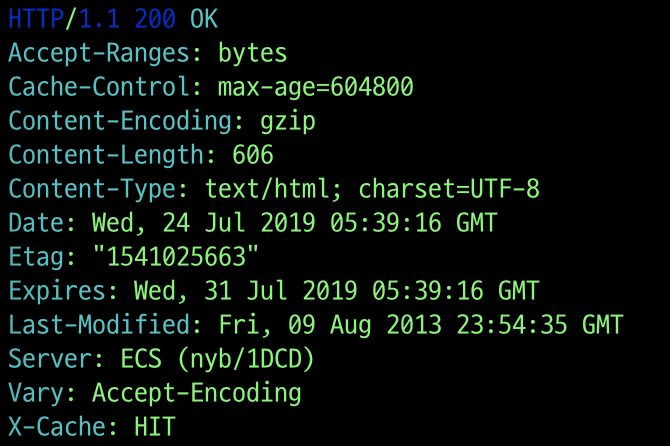<br/>
**Response File**<br/>
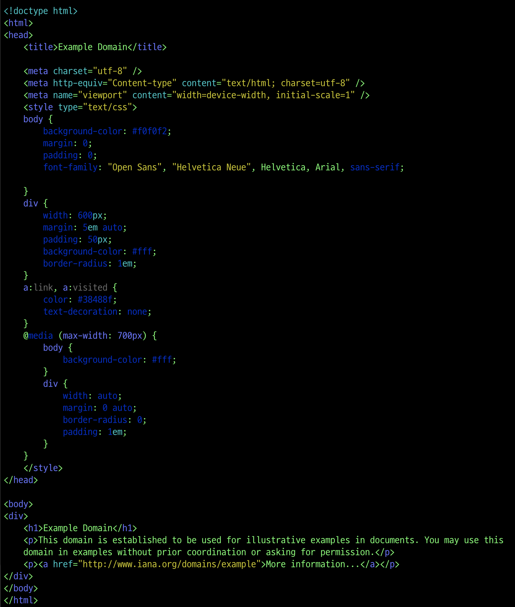

#### GET Request
**GET**은 생략가능<br/>
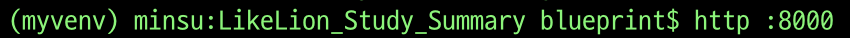<br/>

#### GET Response
**Response Header**<br/>
HTTP 상태코드 **200**으로 요청 성공 확인<br/>
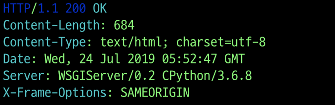<br/>

#### POST Request
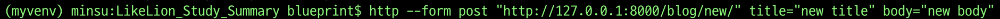<br/>

아래와 같은 명령어로 새로운 Blog **POST** 요청
```
http --form post "http://127.0.0.1:8000/blog/new/" title="new title" body="new body"
```

#### POST Request
HTTP 상태코드 **403**과 **Forbidden**메세지가 확인<br/>
`CSRF verification failed. Request aborted.`<br/>
위와 같은 내용과 함께 **요청이 거절**되는 것을 확인할 수 있다.<br/>
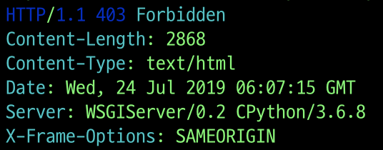<br/>

이는 Django 내부의 보안 기능으로 **차단**된 것이다.<br/>
**DELETE**요청도 마찬가지로 차단될 것이다.

#### 성공한 GET Request
<br/>

#### 성공한 GET Response
**Response Header**<br/>
HTTP 상태코드 **200**으로 요청 성공 확인<br/>
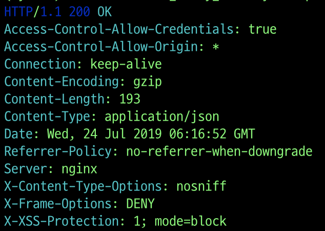<br/>
`agrs`에서 무슨 값을 요청했는지 확인할 수 있고<br/>
아래의 `headers`에서 요청한 Header를 확인할 수 있다.<br/>
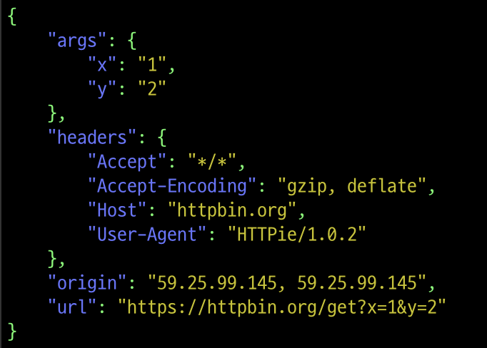<br/>

#### 성공한 POST Request (form)
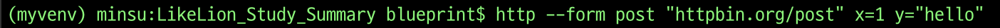<br/>
```
http --form post "httpbin.org/post" x=1 y="hello"
```

#### 성공한 POST Response (form)
**Response Header**<br/>
HTTP 상태코드 **200**으로 요청 성공 확인<br/>
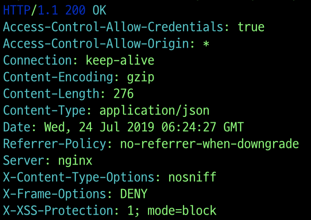<br/>

**form**형식으로 데이터를 요청했기 때문에<br/>
**form**으로 데이터가 전송되고 **json**이 `null`인 것을 확인할 수 있다.
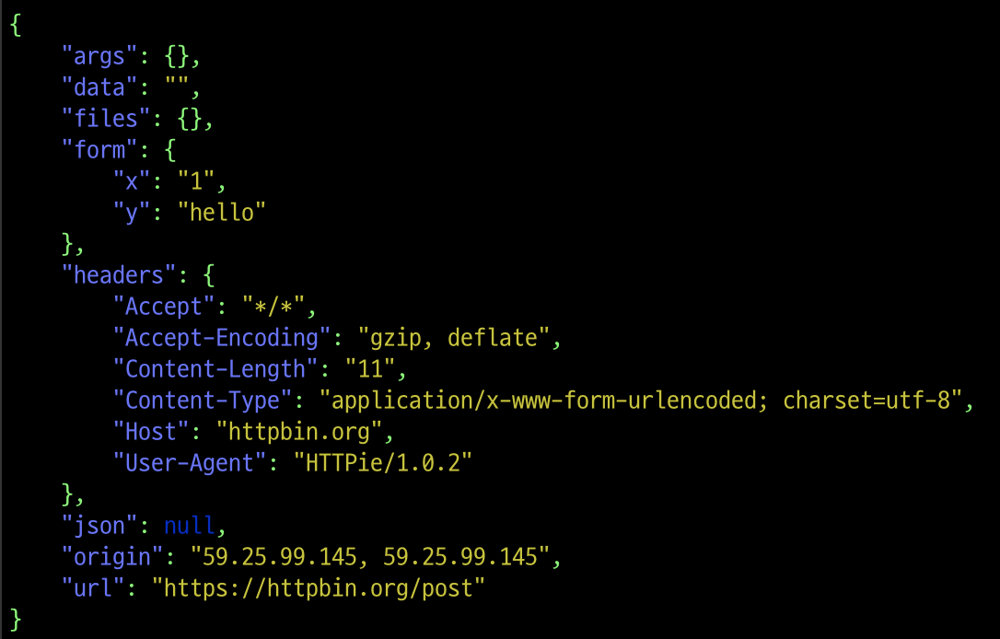<br/>

#### 성공한 POST Request (json)
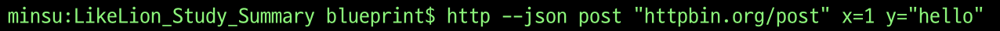<br/>
```
http --json post "httpbin.org/post" x=1 y="hello"
```

#### 성공한 POST Response (json)
**Response Header**<br/>
HTTP 상태코드 **200**으로 요청 성공 확인<br/>
<br/>

**json**형식으로 데이터를 요청했기 때문에<br/>
**json**으로 데이터가 전송되고 **form**이 비어있는 것을 확인할 수 있다.<br/>
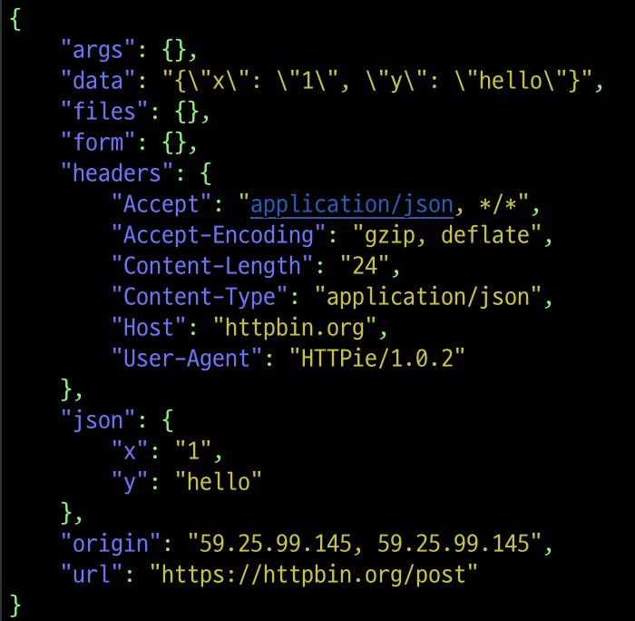<br/>
