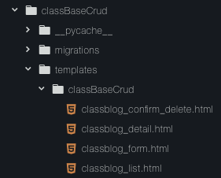
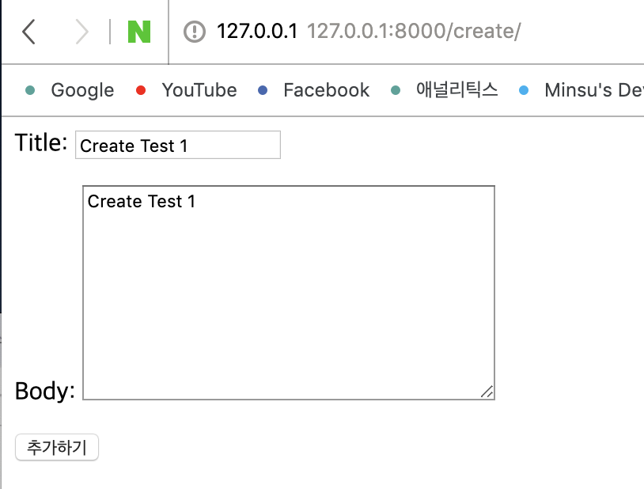
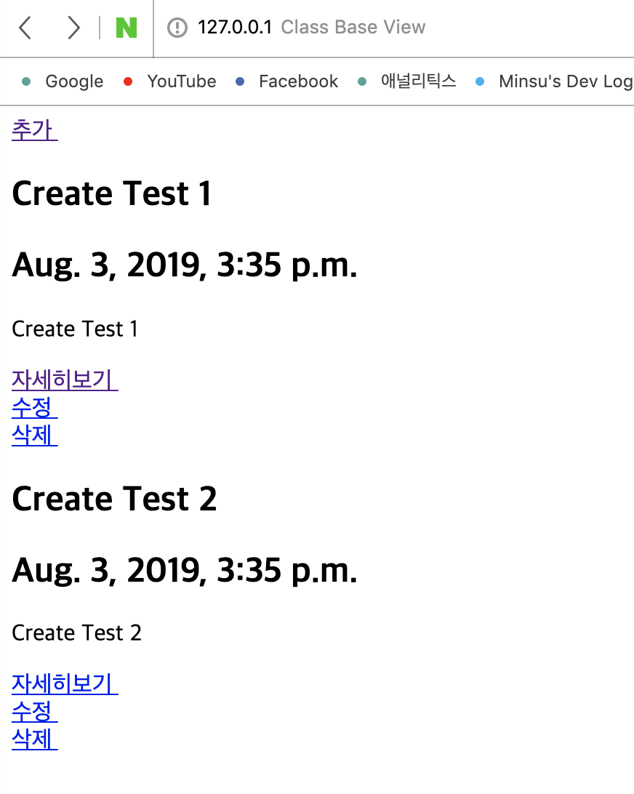
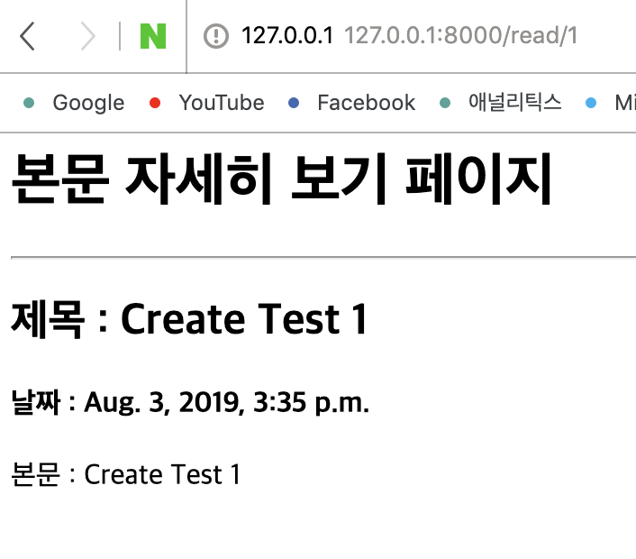
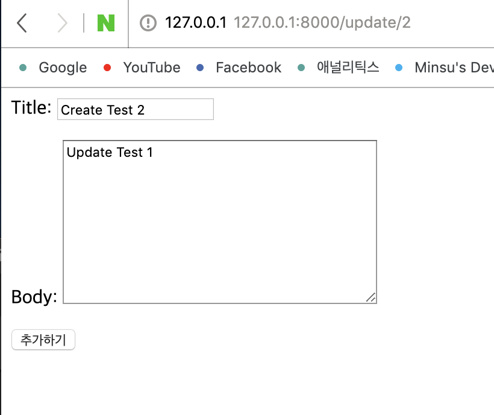
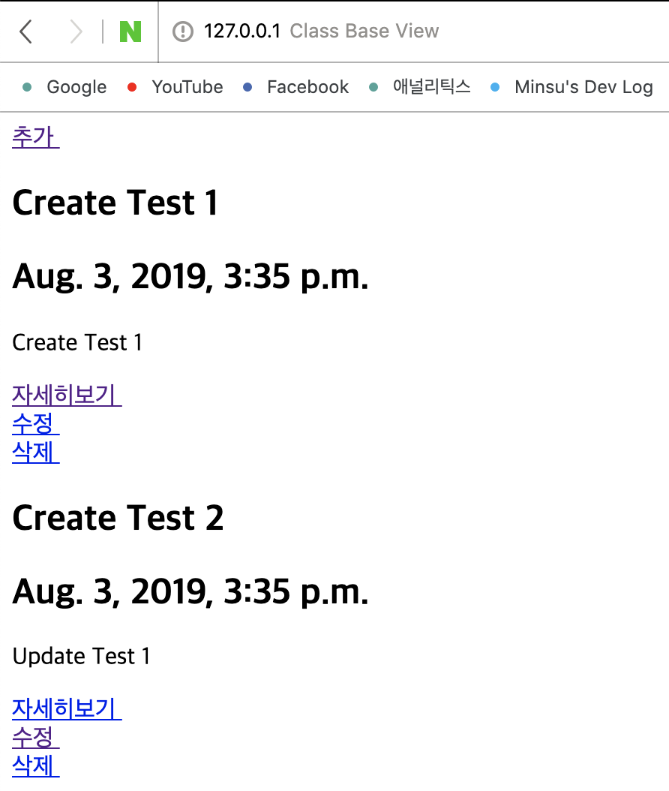
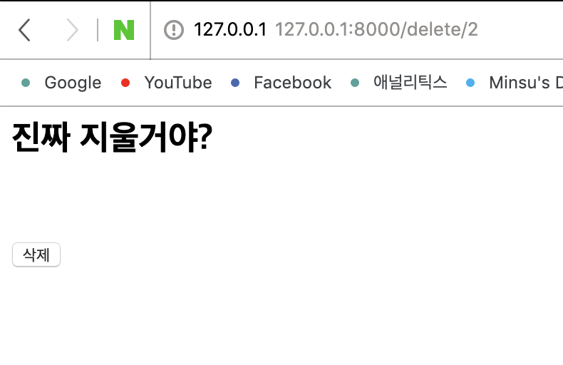
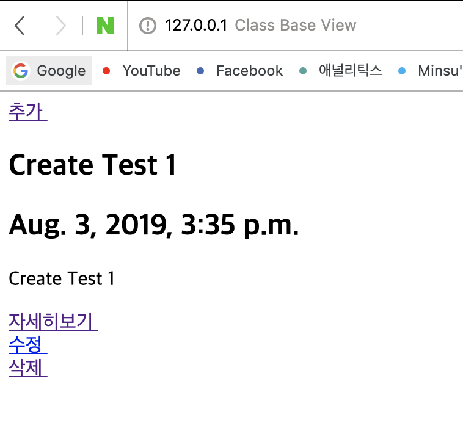

## 1주차 - 3. CBV (3)
수행결과를 보여주는 `HTML` 템플릿이 존재해야한다.<br/>
`ListView`의 경우 블로그 리스트를 담은 `HTML`이 필요<br/>
`CreateView`, `UpdateView`의 경우 입력 공간(**form**)을 갖는 `HTML`이 필요<br/>
`DetailView`의 경우 상세 페이지를 담은 `HTML`이 필요<br/>
`DeleteView`의 경우 삭제 작업을 확인하는 `HTML`이 필요<br/>

### 9. 템플릿 작성하기
**Generic View**에서는 기본적으로 설정된 이름이 존재한다.<br/>
다른 이름으로 `HTML`을 작성하기 위해서는 추가 설정이 필요하다.<br/>

| View 이름  | HTML 이름                         |
| ---------- | --------------------------------- |
| ListView   | (소문자 모델)_list.html           |
| CreateView | (소문자 모델)_form.html           |
| DetailView | (소문자 모델)_detail.html         |
| UpdateView | (소문자 모델)_form.html           |
| DeleteView | (소문자 모델)_confirm_delete.html | 

위의 파일 이름 조건에 맞추어 `HTML`파일을 작성하고 채워 넣는다.<br/>
자세한 내용은 [코드](https://github.com/LikeLionSCH/LikeLion_Study_Summary/tree/master/5_CBV/classBaseCrud/templates)를 참고하세요.<br/>

**object_list** : 지정한 모델로 만들어진 **모든 객체들의 목록**을 말한다.<br/>
**object** :  PK값에 맞는 **지정된 객체**<br/>

### 강의에 나오지 않은 것
`templates`폴더를 구성할 때 `templates`안에 `HTML`파일을<br/>
작성하는 것이 아니라 `App`이름의 폴더를 작성하고 그 **안에 작성**해야 한다.<br/>

#### 예시 스크린샷


### 실행 스크린샷
#### Create View Test


- - -

#### List View Test


- - -

#### Detail View Test


- - -

#### Update View Test


- - -

#### After Update List View Test


- - -

#### Delete View Test


- - -

#### After Delete List View Test


### 임의의 이름으로 템플릿 작성하기
약속되어있는 `HTML`을 이름을 사용하지 않고 작성하기위해서는 아래와 같다.<br/>
해당 `HTML`을 사용할 `Class`에 `template_name`을 설정하면 된다.<br/>

```python
class BlogView(ListView):
    template_name = 'classBaseCrud/list.html'
    model = ClassBlog
```

### 추가 설명
#### 서로 다른 모델 객체 목록은 어떻게 구분하나요?
기본적으로 설정되어 있는 객체를 가져오는 이름은<br/>
`object_list`와 `object`이지만 이것 또한 `views.py`의<br/>
뷰클래스에서 `context_object_name`을 설정해 임의로 사용 가능하다.<br/>

#### 수정된 뷰
```python
class BlogView(ListView):
    template_name = 'classBaseCrud/list.html'
    context_object_name = 'blog_list'
    model = ClassBlog

class BlogRead(DetailView):
    context_object_name = "blog"
    model = ClassBlog    
```

#### 수정된 템플릿
- List View Template
```html

<h2> {{ blog.title }} </h2>
<h2> {{ blog.created_at }} </h2>
<p> {{ blog.body }} </p>

<a href=""> 자세히보기 </a><br>
<a href=""> 수정 </a><br>
<a href=""> 삭제 </a><br>

```

- Detail View Template
```html
<h2> 제목 : {{ blog.title }} </h2>
<h4> 날짜 : {{ blog.created_at }} </h4>
본문 : {{ blog.body }}
```
