## 2주차 - 4. Serializer 실습 - API 서버 들여다보기

### 10. 서버 실행시켜보기
```
python manage.py runserver
```

#### 실행결과
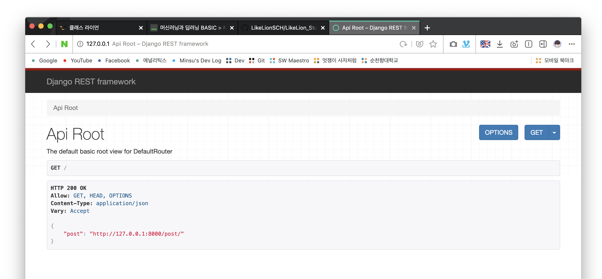<br>

지금까지 본 화면과는 많이 다른 것을 확인할 수 있다.<br>
`urls.py`에 작성된 `DefaultRouter`에 의해 만들어진 기본적인 환경<br>
처음 보여지는 화면은 `GET`요청을 할 수 있는 `url`이 보여진다.

#### 테스트
- Request
```
http GET http://127.0.0.1:8000/
```
- Response
  
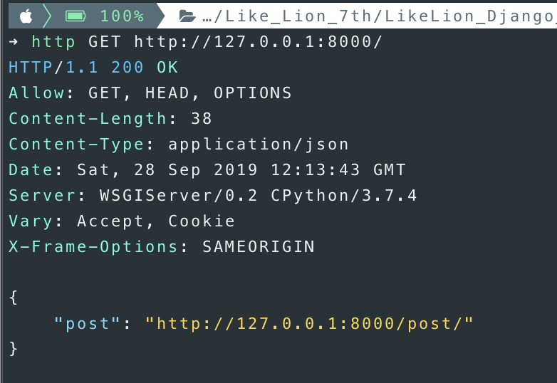<br>
위의 실행결과 페이지와 동일한 결과를 얻을 수 있다.<br>

### 11. post API 사용해보기
- Request
```
http http://127.0.0.1:8000/post/
```
- Response

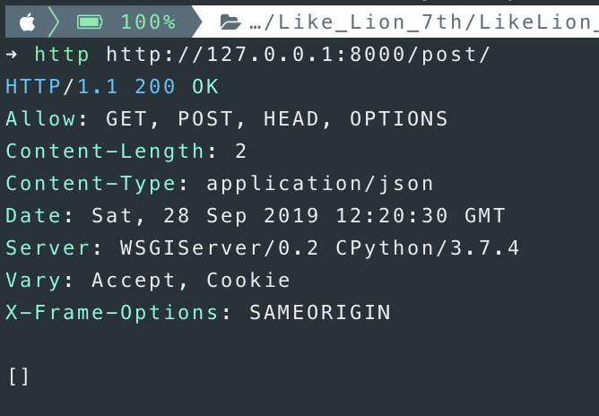<br>

`post`리스트에 아무 데이터가 존재하지 않기때문에 **빈 리스트**가 **반환**된다.<br>

#### 테스트
`http://127.0.0.1:8000/post/1`로 이동해보면 **Allow**부분에 `PUT`이 추가되었다.<br>
아래의 Form을 채우고 `POST`버튼을 누르면 리스트에 값이 들어간 것을 확인할 수 있다.<br>

- `POST`버튼 클릭 전

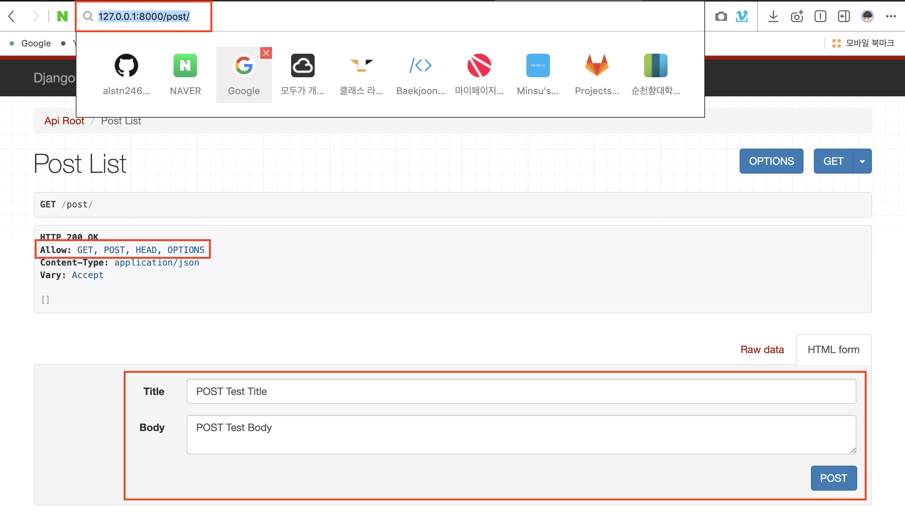<br>

- `POST`버튼 클릭 후

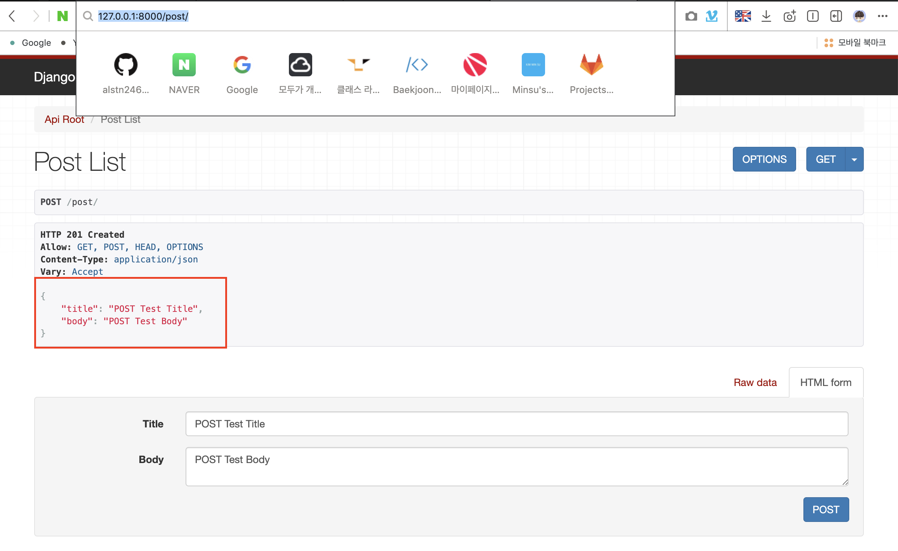<br>

### 12. 명령어로 POST 요청보내기
- Request
```
http --form POST http://127.0.0.1:8000/post/ title="POST Test Title 2" body="POST Test Body 2"
```

- Response

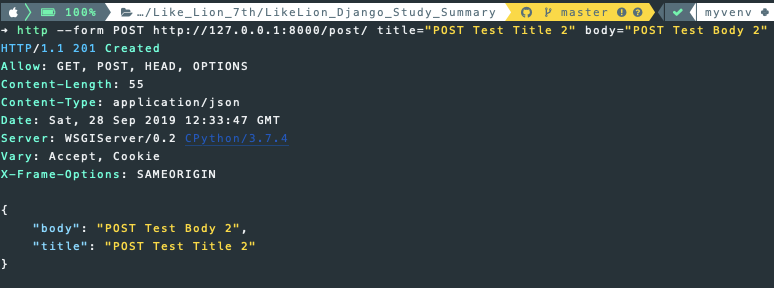<br>

위와 같은 응답으로 `POST`요청이 잘 실행된 것을 확인할 수 있다.<br>
Form을 수정하고 `PUT`버튼을 누르면 값이 변경된 것을 확인할 수 있다.<br>

### 13. 각각의 post객체에 접근하기
`http://127.0.0.1:8000/post/1`로 이동해보면 **Allow**부분에 `PUT`이 추가되었다.<br>

- `PUT`버튼 클릭 전

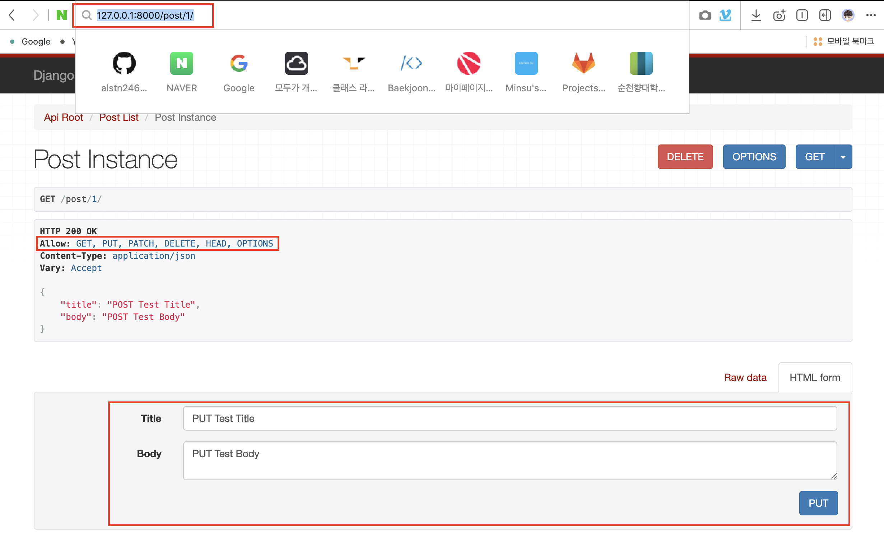<br>

- `PUT`버튼 클릭 후

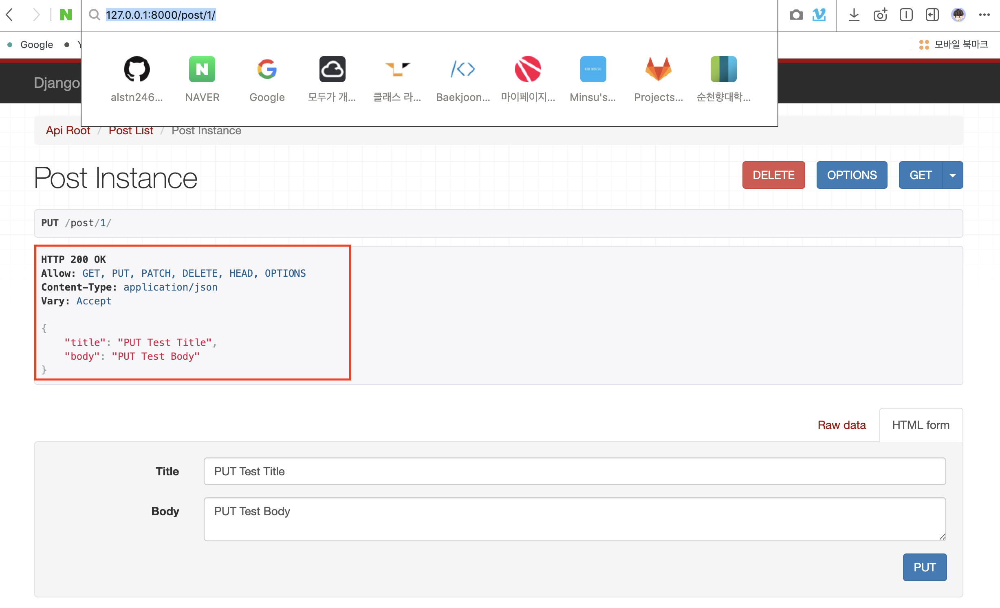<br>

### 14. 각 객체에 pk값 부여하기
`serializer.py`파일의 `PostSerializer`를 아래와 같이 수정한다.<br>
```python
class PostSerializer(serializers.ModelSerializer):
    class Meta:
        model = Post
        fields = ['id', 'title', 'body']
```
페이지를 새로고침해보면 아래와 같은 결과를 얻을 수 있다.<br>
`id`값을 직접적으로 확인이 가능해졌다.<br>
여기서 `id`값은 각 `인스턴스`에 붙는 `고유번호`다.<br>
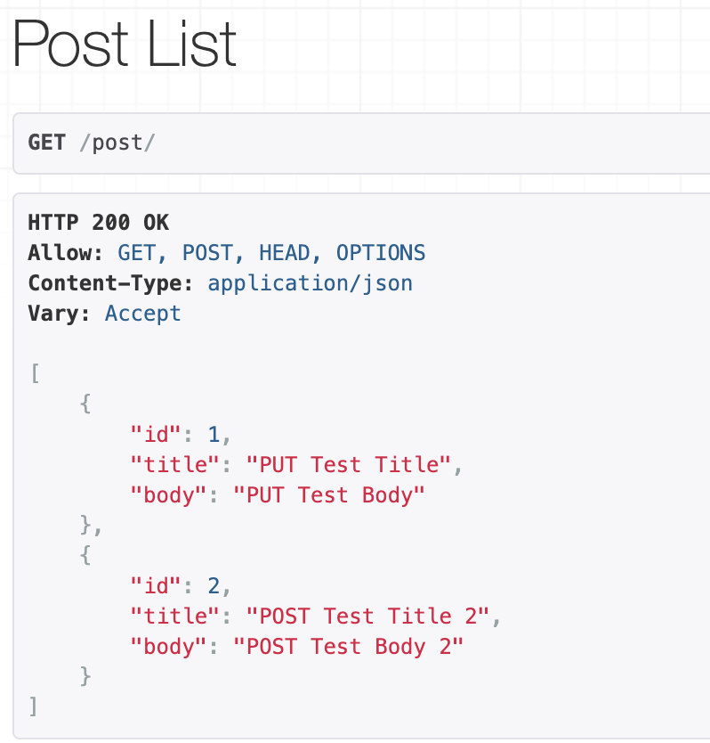<br>

### 15. 명령어로 객체 삭제하기
- Request
```
http DELETE http://127.0.0.1:8000/post/1
```

- Response

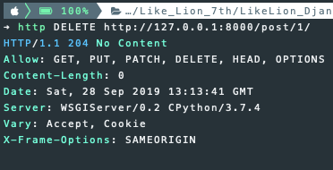<br>

`http://127.0.0.1:8000/post/`로 접속해보면 `id`값이 `1`인 객체가 사라졌다.<br>
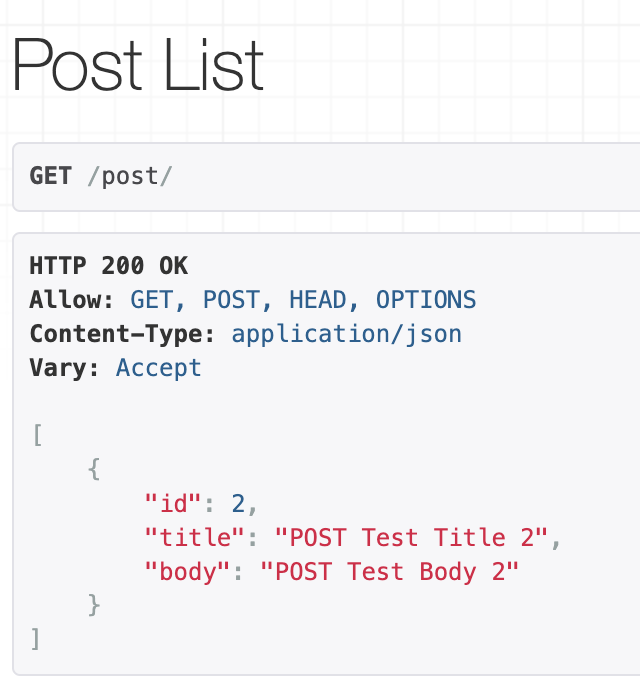<br>

### 16. OPTIONS 알아보기
`OPTIONS`는 해당 객체의 자세한 내용을 표시한다.<br>
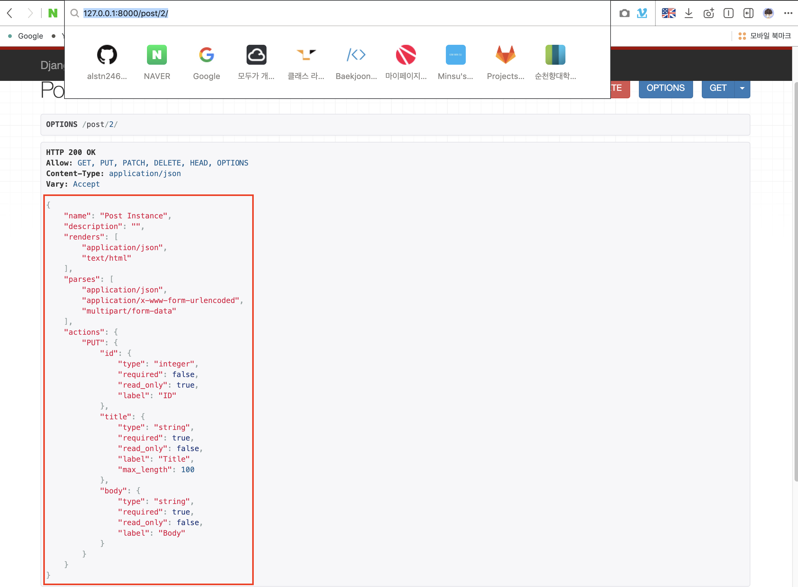<br>

`read_only`속성은 사용자가 마음대로 수정을 할 수 없도록 한다.<br>

### Read Only 설정하기
`serializer.py`파일의 `PostSerializer`를 아래와 같이 수정한다.<br>
`read_only_fields`에 `read_only`속성을 적용할 필드를 `tuple`에 추가한다.<br>
```python
class PostSerializer(serializers.ModelSerializer):
    class Meta:
        model = Post
        fields = "__all__"
        read_only_fields = ("title",)
```

### 테스트
`post`객체의 `title`필드가 `read_only`가 `true`로 변경된 것을 확인할 수 있다.<br>
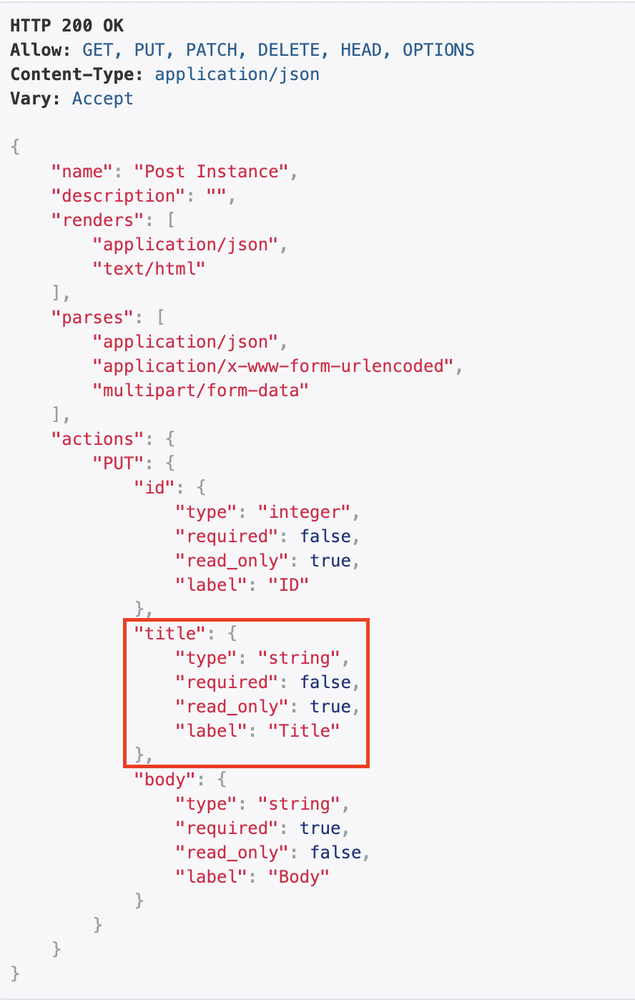<br>

`write_only`로 변경하고 싶다면 `write_only_fileds`에 필드를 정의하면 된다.<br>