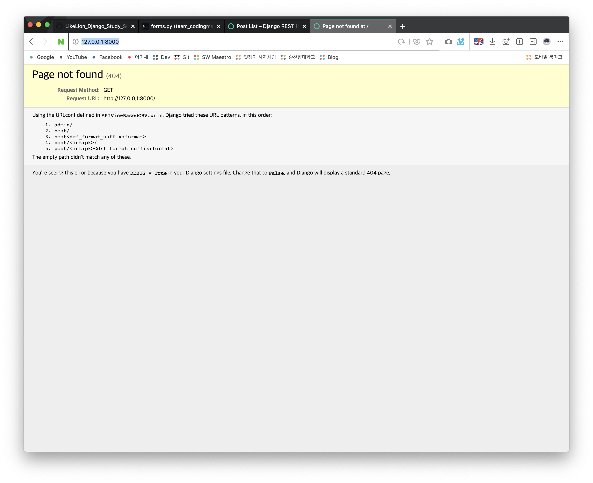
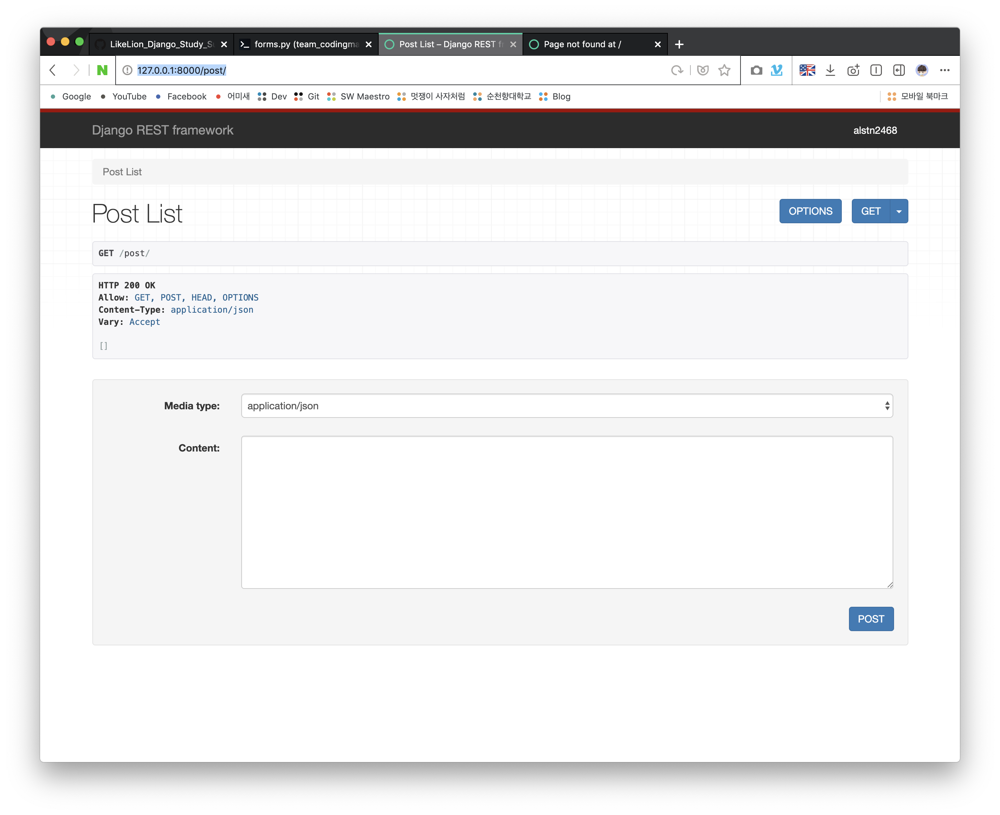
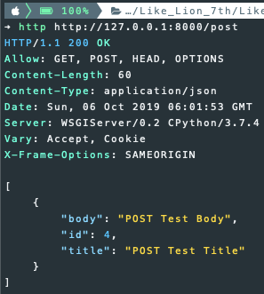
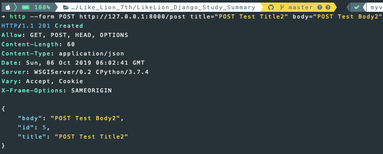
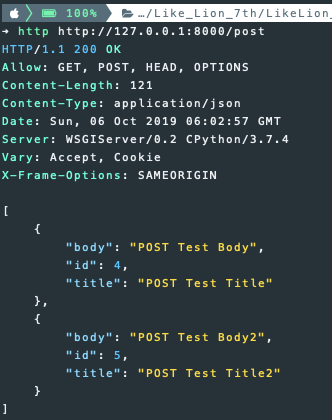
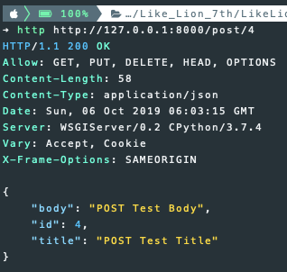
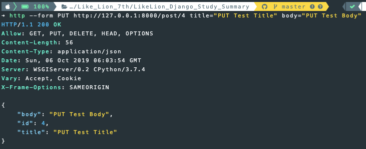
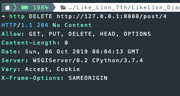

## 3주차 - 2. APIView

### Class Based View

`Class`를 이용해 `View`를 설계하면 좋은점

-   **Reuse** common functionally
-   불필요한 코드를 제거해 코드의 **재사용성**을 높임

**재사용성**이 높아지는 이유

-   `Class`에만 있는 **상속**의 개념

### APIView를 상속받은 CBV

`APIView`를 상속해서 `View`를 설계할 때는<br>
`status`와 `Response`를 `import`해와 **Response** 과정을 작성한다.<br>

`APIView`를 상속해서 만든 **CBV**의 내부 함수들은<br>
필요로 하는 `HTTP Method`를 이름으로 갖는다.<br>

#### 예시

`SnippetDetail`클래스에서 필요한 `Method`는 `GET`, `PUT`, `DELETE` 다.<br>

```python
class SnippetDetail(APIView):
    def get(...):
        ...

    def put(...):
        ...

    def delete(...):
        ...
```

어떠한 `status`를 받고 `Response`를 전달할지 직접 정하는 것이<br>
`APIView`를 상속받은 **CBV**의 의의다.<br>

### 직접 작성해보기

#### 1. 이전의 과정 동일하게 진행

1.  `django-admin startproject <project-name>`
2.  `cd <project-name>`
3.  `python manage.py startapp <app-name>`
4.  `settings.py`에 App, `rest_framework`추가
5.  `models.py`에 모델 작성 및 `migrate`

```python
class Post(models.Model):
    title = models.CharField(max_length=100)
    body = models.TextField()
```

6. `serializer.py`생성 및 작성

```python
from .models import Post
from rest_framework import serializers


class PostSerializer(serializers.ModelSerializer):
    class Meta:
        model = Post
        fields = "__all__"
```

### 2. views.py 작성하기

#### 1) 필요한 모듈 추가

`APIView`를 상속받은 **CBV**를 작성하기 위해 아래의 모듈을 추가한다.<br>

```python
from CBV.models import Post
from CBV.serializer import PostSerializer
from django.http import Http404
from rest_framework.response import Response
from rest_framework import status
from rest_framework.views import APIView
```

#### 2) 객체들의 목록을 가져오는 PostList 작성

`GET`매서드는 다수의 `Post`객체를 반환하는 메서드다.<br>
다수의 객체를 **직렬화**하기 위해서 `PostSerializer`에 `many=True`를 넘겨줘야 한다.<br>

`POST`메서드는 새로운 객체를 생성하는 함수다.<br>
**요청**을 받은 데이터를 **직렬화**한 후 `is_valid`함수로 **유효성 검사** 후 저장<br>
저장 성공 시 상태코드 `201(CREATED)`반환 실패시 `400(BAD REQUEST)`반환<br>

```python
class PostList(APIView):
    def get(self, request):
        posts = Post.objects.all()
        serializer = PostSerializer(posts, many=True)

        return Response(serializer.data)

    def post(self, request):
        serializer = PostSerializer(data=request.data)

        if serializer.is_valid():
            serializer.save()

            return Response(serializer.data, status=status.HTTP_201_CREATED)

        return Response(serializer.errors, status=status.HTTP_400_BAD_REQUEST)
```

### 3) 객체의 상세 정보를 받는 PostDetail 작성

`PostList`클래스와 다르게 각각의 함수에 `pk`값을 인자로 받는다.<br>
`get_object`함수는 `get_object_or_404`함수와 동일한 기능을 한다.<br>
`PostList`에서 작성한 함수들과 비슷한 방식으로 작동한다.<br>

```python
class PostDetail(APIView):
    def get_object(self, pk):
        try:
            return Post.objects.get(pk=pk)
        except Post.DoesNotExist:
            return Http404

    def get(self, request, pk, format=None):
        post = self.get_object(pk)
        serializer = PostSerializer(post)

        return Response(serializer.data)

    def put(self, request, pk, format=None):
        post = self.get_object(pk)
        serializer = PostSerializer(post, data=request.data)

        if serializer.is_valid():
            serializer.save()

            return Response(serializer.data)

        return Response(serializer.errors, status=status.HTTP_400_BAD_REQUEST)

    def delete(self, request, pk, format=None):
        post = self.get_object(pk)
        post.delete()

        return Response(status=status.HTTP_204_NO_CONTENT)
```

### 4) urls.py 작성하기

-   App내부의 `urls.py`

`rest_framework.urlpatterns`의 `format_suffix_patterns`모듈을 추가하고<br>
`views.py`를 가져와 `<ClassName>.as_view()`형식으로 작성한다.<br>

```python
from django.urls import path, include
from rest_framework.urlpatterns import format_suffix_patterns
from . import views

urlpatterns = [
    path("post", views.PostList.as_view()),
    path("post/<int:pk>", views.PostDetail.as_view()),
]

urlpatterns = format_suffix_patterns(urlpatterns)
```

-   프로젝트 폴더의 `urls.py`

`include`를 사용해 앱의 `url.py`를 가져와 **PATH**설정<br>

```python
from django.contrib import admin
from django.urls import path, include
import CBV.urls

urlpatterns = [
    path('admin/', admin.site.urls),
    path('', include(CBV.urls)),
]
```

### 실행결과

`http://127.0.0.1:8000/`에 접속해보자.<br>
아래와 같은 결과가 나오는 것을 확인할 수 있다.<br>
**PATH**가 `" "`인 `url`을 설계하지 않았기 때문이다.<br>

<br>

`http://127.0.0.1:8000/post`로 접속하면 결과가 잘 보여지는 것을 볼 수 있다.<br>

<br>

### httpie로 테스트 하기

-   `PostList`클래스 `GET`매서드 테스트

<br>

-   `PostList`클래스 `POST`매서드 테스트

<br>

-   `PostList`클래스 `GET`매서드 테스트

<br>

-   `PostDetail`클래스 `GET`매서드 테스트

<br>

-   `PostDetail`클래스 `PUT`매서드 테스트

<br>

-   `PostDetail`클래스 `DELETE`매서드 테스트

<br>
