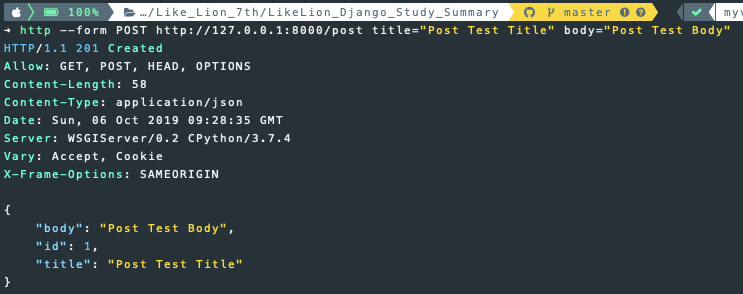
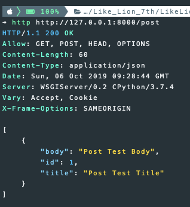
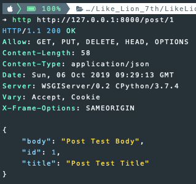
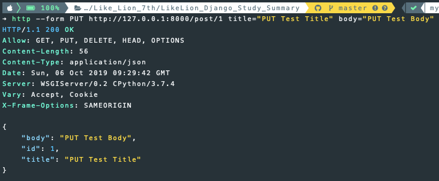
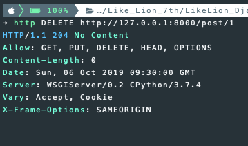

## 3주차 - 3. mixins

### APIView를 상속해 CBV 구현시 문제점

-   여러가지 모델을 사용할 경우 비슷한 논리의 코드가 **반복**된다.

이러한 불필요한 반복을 제거하기 위해 생긴 것이 **mixins**이다.<br>
**상속**을 통해서 불필요한 **반복**을 **제거**한다.<br>

### Mixins 적용해보기

#### 1. views.py 작성하기 전

이전과 동일한 코드이기 때문에 생략합니다.

1.  `django-admin startproject <project-name>`
2.  `cd <project-name>`
3.  `python manage.py startapp <app-name>`
4.  `settings.py`에 App, `rest_framework`추가
5.  `models.py`에 모델 작성 및 `migrate`
6.  `serializer.py`생성 및 작성

#### 2. views.py 작성하기

##### 1) 필요한 모듈 추가하기

```python
from .models import Post
from serializer import PostSerializer
from rest_framework import generics
from rest_framework import mixins
```

##### 2) PostList 클래스 작성하기

`APIView`를 상속해서 작성한 `PostList` 클래스와 동일한 기능을 한다.<br>
`mixins`의 `ListModelMixin`과 `CreateModelMixin`, `generics`의 `GenericAPIView`를 상속<br>
사용할 모델의 **쿼리셋**과 `Serializer` 클래스를 등록해주고<br>
객체 목록을 가져오는 `GET`메서드는 `ListModelMixin`에 구현된 `list`함수를 사용<br>
객체를 생성하는 `POST`메서드는 `CreateModelMixin`에 구현된 `create`함수를 사용한다.<br>

```python
class PostList(mixins.ListModelMixin,
               mixins.CreateModelMixin,
               generics.GenericAPIView):
    queryset = Post.objects.all()
    serializer_class = PostSerializer

    def get(self, request, *args, **kwargs):
        return self.list(request, *args, **kwargs)

    def post(self, request, *args, **kwargs):
        return self.create(request, *args, **kwargs)
```

##### 3) PostDetail 클래스 작성하기

`PostList`를 작성한 것과 동일하게 작성<br>
각 메서드에 필요한 `mixins` 모듈을 **상속**하고 **쿼리셋**, `serializer`등록 후<br>
각 `HTTP Method` 함수를 작성하면 된다.<br>

```python
class PostDetail(mixins.RetrieveModelMixin,
                 mixins.UpdateModelMixin,
                 mixins.DestroyModelMixin,
                 generics.GenericAPIView):
    queryset = Post.objects.all()
    serializer_class = PostSerializer

    def get(self, request, *args, **kwargs):
        return self.retrieve(request, *args, **kwargs)

    def put(self, request, *args, **kwargs):
        return self.update(request, *args, **kwargs)

    def delete(self, request, *args, **kwargs):
        return self.destroy(request, *args, **kwargs)
```

#### 3. urls.py 작성하기

이전과 동일하게 앱 내부에 `urls.py` 생성 및 작성

```python
from django.urls import path
from rest_framework.urlpatterns import format_suffix_patterns
from . import views

urlpatterns = [
    path("post", views.PostList.as_view()),
    path("post/<int:pk>", views.PostDetail.as_view()),
]

urlpatterns = format_suffix_patterns(urlpatterns)
```

프로젝트 폴더 내부의 `urls.py`에 `include`

```python
from django.contrib import admin
from django.urls import path, include
import post.urls

urlpatterns = [
    path('admin/', admin.site.urls),
    path('', include(post.urls)),
]
```

#### 실행 결과

`http://127.0.0.1:8000/post`로 접속하면 잘 작동하는 것을 확인할 수 있다.<br>

<br>

### httpie로 테스트 하기

-   `PostList`클래스 `POST`매서드 테스트

<br>

-   `PostList`클래스 `GET`매서드 테스트

<br>

-   `PostDetail`클래스 `GET`매서드 테스트

<br>

-   `PostDetail`클래스 `PUT`매서드 테스트

<br>

-   `PostDetail`클래스 `DELETE`매서드 테스트

<br>