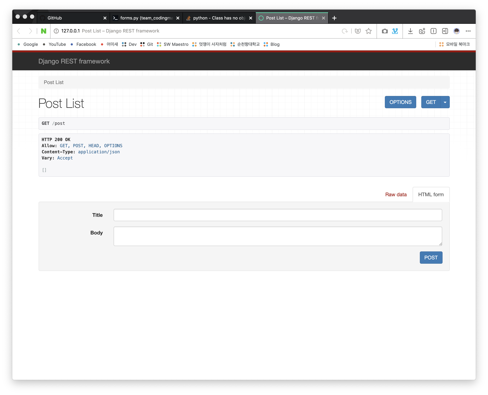
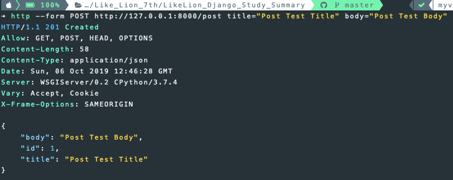
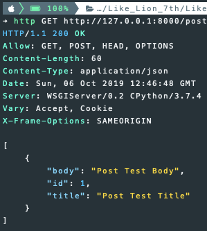
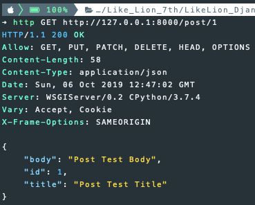
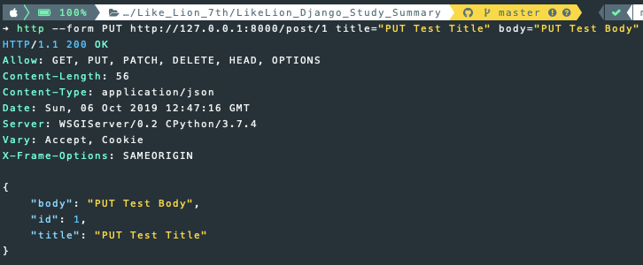
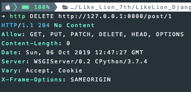

## 3주차 - 4. generic CBV

### Generic CBV 적용하기

#### 1. views.py 작성하기 전

이전과 동일한 코드이기 때문에 생략합니다.

1.  `django-admin startproject <project-name>`
2.  `cd <project-name>`
3.  `python manage.py startapp <app-name>`
4.  `settings.py`에 App, `rest_framework`추가
5.  `models.py`에 모델 작성 및 `migrate`
6.  `serializer.py`생성 및 작성

#### 2. views.py 작성하기

##### 1) 필요한 모듈 추가하기
사용할 **모델**, `serializer`, `rest_framework`의 `generics`를 추가<br>
```python
from .models import Post
from .serializer import PostSerializer
from rest_framework import generics
```

##### 2) PostList 클래스 작성하기

`generics`의 `ListCreateAPIView`는 `mixins`에서 사용한<br>
`list`함수와 `create`함수를 가지고 있는 `Class`다.

```python
class PostList(generics.ListCreateAPIView):
    queryset = Post.objects.all()
    serializer_class = PostSerializer
```

##### 3) PostDetail 클래스 작성하기

`generics`의 `RetrieveUpdateDestroyAPIView` 또한<br> `mixins`에서 사용한 함수들과 동일한 기능을 한다.<br>

```python
class PostDetail(generics.RetrieveUpdateDestroyAPIView):
    queryset = Post.objects.all()
    serializer_class = PostSerializer
```

#### 3. urls.py 작성하기

이전과 동일하게 앱 내부에 `urls.py` 생성 및 작성

```python
from django.urls import path
from rest_framework.urlpatterns import format_suffix_patterns
from . import views

urlpatterns = [
    path("post", views.PostList.as_view()),
    path("post/<int:pk>", views.PostDetail.as_view()),
]

urlpatterns = format_suffix_patterns(urlpatterns)
```

프로젝트 폴더 내부의 `urls.py`에 `include`

```python
from django.contrib import admin
from django.urls import path, include
import post.urls

urlpatterns = [
    path('admin/', admin.site.urls),
    path('', include(post.urls)),
]
```

#### 실행 결과

`http://127.0.0.1:8000/post`로 접속하면 잘 작동하는 것을 확인할 수 있다.<br>

<br>

### httpie로 테스트 하기

모든 기능들이 이전과 같이 동작한다.<br>

-   `PostList`클래스 `POST`매서드 테스트

<br>

-   `PostList`클래스 `GET`매서드 테스트

<br>

-   `PostDetail`클래스 `GET`매서드 테스트

<br>

-   `PostDetail`클래스 `PUT`매서드 테스트

<br>

-   `PostDetail`클래스 `DELETE`매서드 테스트

<br>