## 3주차 - 5. ViewSet

### ViewSet

`rest_framework`의 `viewsets.py`내부에는 4개의 클래스가 존재한다.<br>

-   `ViewSet`
-   `GenericViewSet`
-   `ReadOnlyModelViewSet`
-   `ModelViewSet`

모두 간단하게 구성되어 `mixins`와 `GenricViewSet`, `APIView`등을 묶는 역할을 한다.<br>

### ReadOnlyModelViewSet

#### 상속 받은 클래스

-   `mixins.RetrieveModelMixin`
-   `mixins.ListModelMixin`
-   `GenericViewSet`

**상속** 받은 클래스를 미루어보아 해당 `ViewSet`의 역할은<br>
`retrieve`함수와 `list`함수의 기능을 갖고있는 것을 유추할 수 있다.<br>

#### 기능

-   특정 객체를 가져오는 역할 (`retrieve`)
-   객체 목록을 가져오는 역할 (`list`)

객체를 읽을 수 있는 즉 **ReadOnly**를 수행하는 `ViewSet`이다.<br>

#### 예시

아래와 같이 작성하면 기존에 작성한 `PostList`, `PostDetail`클래스의 기능을<br>
따로 작성하지 않아도 `ReadOnlyModelViewSet`을 상속받아 사용할 수 있다.<br>

```python
from rest_framework import viewsets
from .models import Post
from .serializer import PostSerializer

class PostViewSet(viewsets.ReadOnlyModelViewSet):
    queryset = Post.objects.all()
    serializer_class = PostSerializer
```

### ModelViewSet

#### 예시

이전과 동일하게 어떠한 **모델**과 `serializer`를 사용할 건지 등록한다.<br>
`permission_classes`는 `action`을 수행할 수 있는 **권한**을 설정하는 변수다.<br>

-   `IsAuthenticatedOrReadOnly` : 권한이 없을 경우 `ReadOnly`
-   `IsOwnerOrReadOnly` : 소유자가 아닐 경우 `ReadOnly`

```python
from rest_framework import viewsets
from rest_framework.decorators import action
from rest_framework.response import Response

class SnippetViewSet(viewsets.ModelViewSet):
    queryset = Snippet.objects.all()
    serializer_class = SnippetSerializer
    permission_classes = [
        permission.IsAuthenticatedOrReadOnly,
        IsOwnerOrReadOnly,
    ]

    @action(detail=True, renderer_classes=[renderers.StaticHTMLRenderer])
    def highlight(self, request, *args, **kwargs):
        snippet = self.get_object()
        return Response(snippet.highlighted)

    def perform_create(self, serializer):
        serializer.save(owner=self.request.user)
```

위의 **Custom API**함수는 Default로 `GET` 매서드로 처리된다.<br>
다른 메서드로 처리하고 싶다면 `action`의 `format`인자로 지정이 가능하다.<br>

### action decorator

`@`는 **decorator**, **장식자**라고 부른다.<br>
`ViewSet`을 이용하면 **CRUD**는 **간단**하게 구현되나 **다른 논리**들을 구현할 때<br>
`@action`를 사용한다. 개발자가 **임의**로 `View`를 **설계**할 수 있도록 해준다.<br>

### renderer_classes

`Response`를 어떤 형식으로 `Rendering`시킬 것인가를 정의<br>

-   `renderer.JSONRenderer`
-   `renderer.BrowsableAPIRenderer`
-   `renderer.StaticHTMLRenderer`
-   `TemplateHTMLRenderer`

등 여러가지가 있다. 기본 설정은 `JSONRenderer`와 `BrowsableAPIRenderer`다.<br>

### ViewSet 적용하기

#### 1. views.py 작성하기 전

이전과 동일한 코드이기 때문에 생략합니다.

1.  `django-admin startproject <project-name>`
2.  `cd <project-name>`
3.  `python manage.py startapp <app-name>`
4.  `settings.py`에 App, `rest_framework`추가
5.  `models.py`에 모델 작성 및 `migrate`
6.  `serializer.py`생성 및 작성

#### 2. views.py 작성하기

##### 1) 필요한 모듈 추가하기

```python
from .models import Post
from .serializer import PostSerializer
from rest_framework import viewsets
from rest_framework import renderers
from rest_framework.decorators import action
from django.http import HttpResponse
```

#### 2) ReadOnlyModelViewSet을 상속해 클래스 작성하기

`viewsets`의 `ReadOnlyModelViewSet`을 **상속**받아 작성한다.<br>
`ReadOnlyModelViewSet`을 **상속**받았으므로 읽기만 가능하다.<br>

```python
class PostViewSet(viewsets.ReadOnlyModelViewSet):
    queryset = Post.objects.all()
    serializer_class = PostSerializer
```

### 3. urls.py 작성하기

-   `post`앱 내부의 `urls.py`

```python
from rest_framework.routers import DefaultRouter
from django.urls import include, path
from .views import PostViewSet

router = DefaultRouter()
router.register('', PostViewSet)

urlpatterns = [
    path('post', include(router.urls))
]
```

-   프로젝트 폴더의 `urls.py`

```python
from django.contrib import admin
from django.urls import path, include
import post.urls

urlpatterns = [
    path('admin/', admin.site.urls),
    path('', include(post.urls)),
]
```

### 실행 결과

`http://127.0.0.1:8000/`로 접속하면 아래와 같은 결과를 확인할 수 있다.<br>
`DefaultRouter`를 사용했기 때문에 **PATH**가 `""`일때도 화면이 나온다.<br>

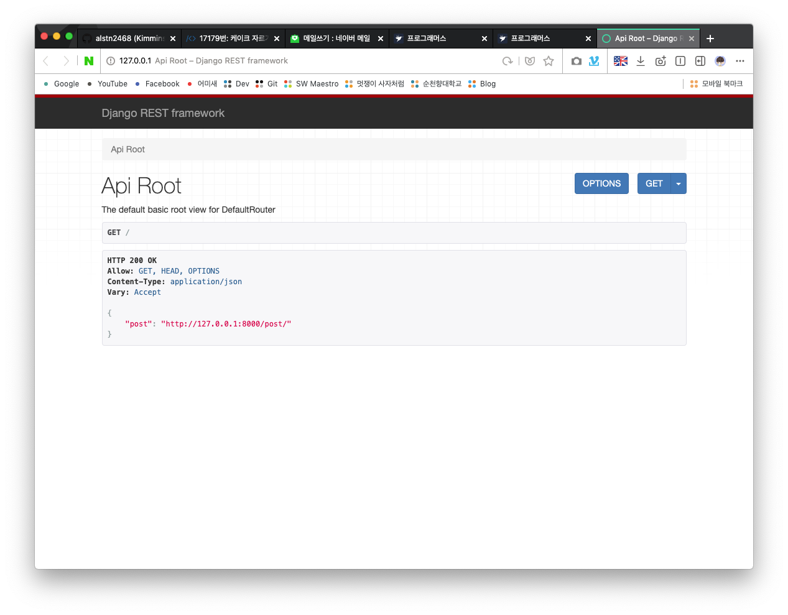<br>

`http://127.0.0.1:8000/post`로 접속하면 사용가능한 `HTTP Method`가<br>
`ReadOnlyModelViewSet`을 **상속**받았으므로 `GET`밖에 없다.<br>

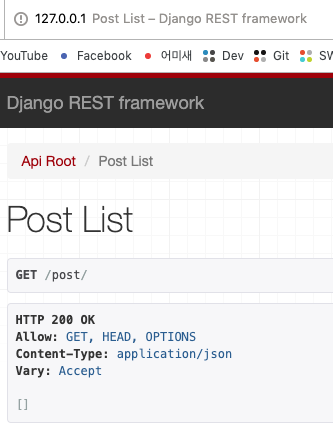<br>

### 4. ModelViewSet 상속해 클래스 작성하기

`viewsets`의 `ModelViewset`을 상속받은 `PostViewSet`클래스를 작성한다.<br>
사용할 **모델**과 `serializer`를 등록하는 것은 기존과 동일하다.<br>
추가적으로 `@action` 데코레이터를 이용해 **Custom API**함수를 작성했다.<br>
`GET`방식으로 `@action Custom API Test`를 띄우는 `highlight`함수를 작성<br>

```python
class PostViewSet(viewsets.ModelViewSet):
    queryset = Post.objects.all()
    serializer_class = PostSerializer

    @action(detail=True, renderer_classes=[renderers.StaticHTMLRenderer])
    def highlight(self, request, *args, **kwargs):
        return HttpResponse("@action Custom API Test")
```

`POST`로 처리하고 싶다면 `@action(method=['post])`와 같이 작성하면 된다.<br>

### 실행 결과

`http://127.0.0.1:8000/post`로 접속하면 사용가능한 `HTTP Method`가<br>
`GET`외에도 `POST`가 추가된 것을 확인할 수 있다.<br>

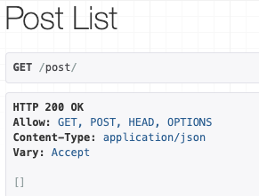<br>

### httpie로 테스트 하기

-   `PostList`클래스 `POST`매서드 테스트

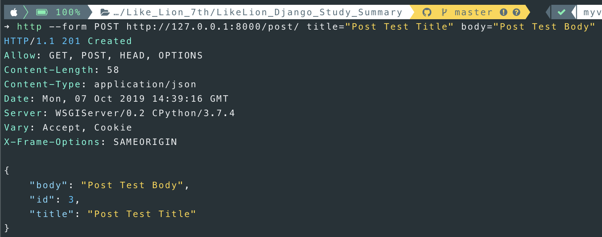<br>

-   `PostList`클래스 `GET`매서드 테스트

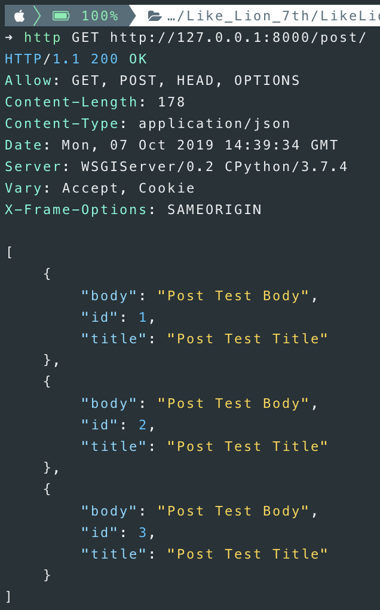<br>

-   `PostDetail`클래스 `GET`매서드 테스트

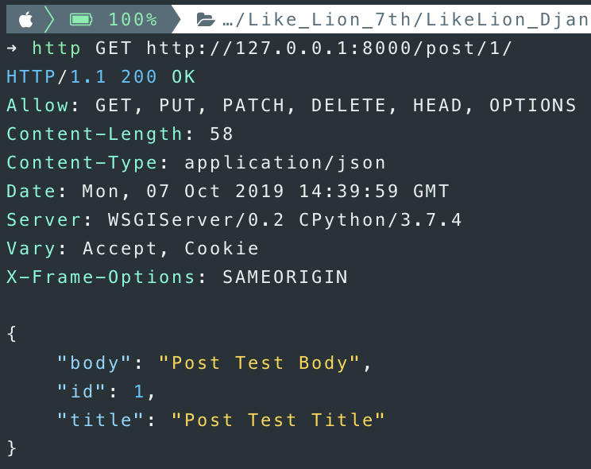<br>

-   `PostDetail`클래스 `PUT`매서드 테스트

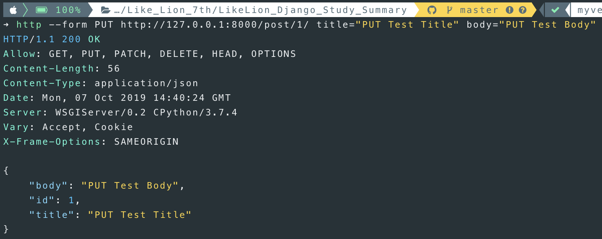<br>

-   `PostDetail`클래스 `DELETE`매서드 테스트

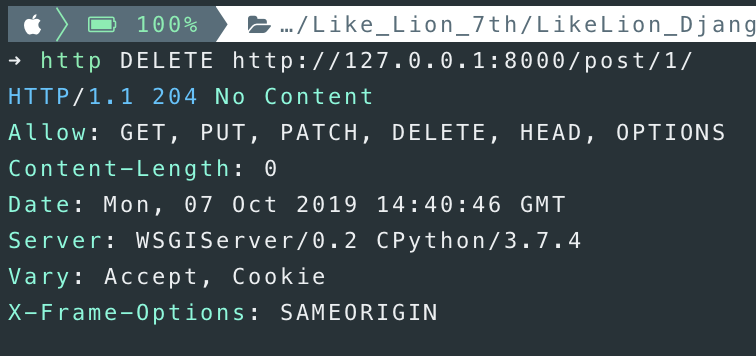<br>

### Custom API 테스트하기

`http://127.0.0.1:8000/post/2/`와 같이 Detail페이지로 접속하면<br>
사진과 같이 **Extra Actions** 스크롤 메뉴가 생긴 것을 확인할 수 있다.<br>

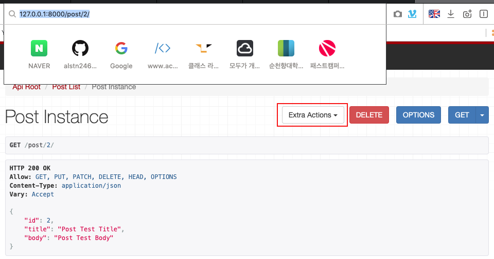<br>

스크롤 메뉴에서 **highlight**버튼을 클릭하면 아래와 같은 결과를 얻을 수 있다.<br>

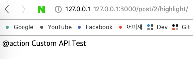<br>

#### httpie로 테스트하기

`@action`으로 작성한 **Custom API**역시 `httpie`로 테스트가 가능하다.<br>
아래와 같이 `Request`를 보내면 `Response`가 반환되는 것을 확인할 수 있다.<br>

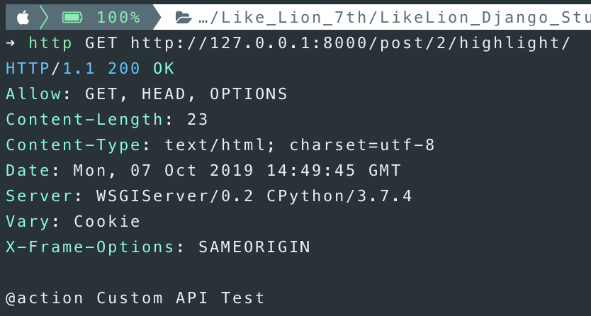<br>
