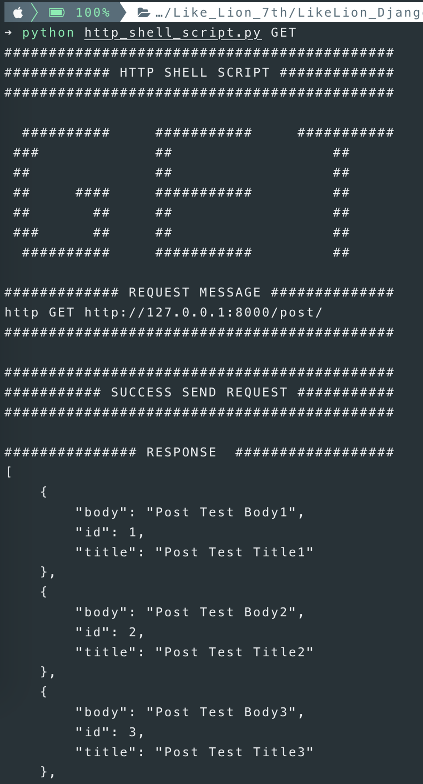
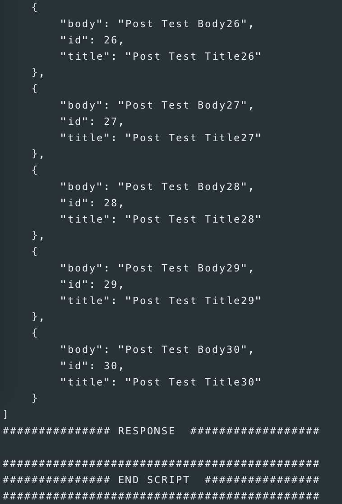
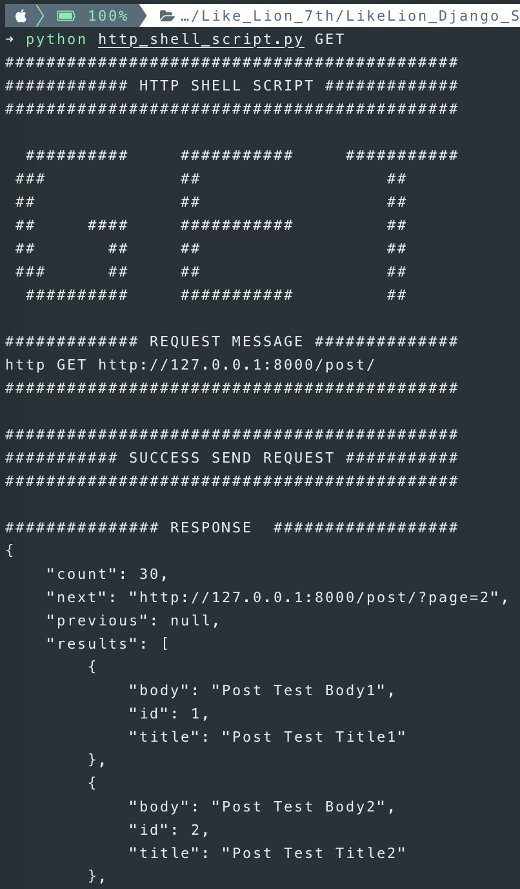
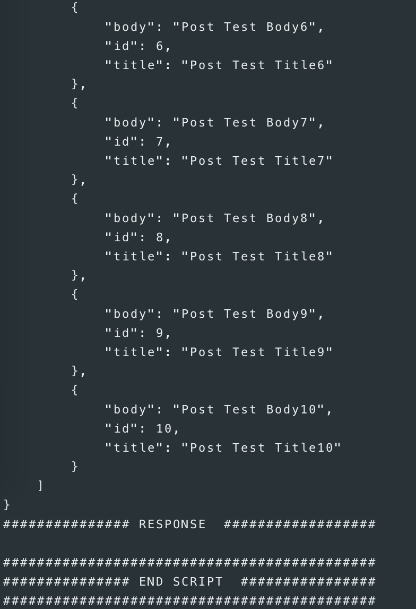

## 4주차 - 1. pagination

### API 서버에서의 Pagination

웹 서비스를 만드는 것처럼 꾸밀 필요가 없는 서버를 구성하지만<br>
**Pagination**기능은 `API Server`에서도 필요하다.<br>

사용자가 게시판의 **전체 글 목록을 요청**했을 때 **수많은 데이터**들을 **한번**에 전달한다면<br>
데이터를 받는 사용자는 많은 데이터를 **감당할 수 없을 것**이다.<br>

### API 서버에서 Pagination을 사용하는 이유

하나의 `Request`만으로 처리하기 어려운 **레코드**들을<br>
여러 `Request`로 나누어 전송하기 위해 사용한다.<br>

### DRF에서의 Pagination

1.  `PageNumberPagination`
2.  `LimitOffsetPagination`
3.  `CursorPagination`
4.  `CustomizedPagination`

1번에서 3번은 `django restframework`에서 제공하는 **Pagination**클래스고<br>
4번은 직접 **Pagination**클래스를 **직접 커스터마이징** 해서 사용하는 방법이다.<br>

흔히 `PageNumberPagination`을 `Default`로 설정하고<br>
**추가적인** 페이지 **설정**이 필요한 부분만 `CustomizedPagination`을 사용한다.<br>

### 프로젝트 기본 세팅

#### 1. Django Project 생성

#### 2. 경로 이동 및 앱 생성

#### 3. settings.py에 앱 등록

#### 4. models.py 작성 및 admin.py 연결

#### 5. makemigrations 및 migrate 진행

#### 6. serializer.py 생성 및 작성

```python
from .models import Post
from rest_framework import serializers


class PostSerializer(serializers.ModelSerializer):
    class Meta:
        model = Post
        fields = "__all__"
```

#### 7. views.py 작성

```python
from .models import Post
from .serializer import PostSerializer
from rest_framework import viewsets


class PostViewSet(viewsets.ModelViewSet):
    queryset = Post.objects.all()
    serializer_class = PostSerializer
```

#### 8. urls.py 작성하기

-   앱 내부의 urls.py

```python
from rest_framework.routers import DefaultRouter
from django.urls import include, path
from .views import PostViewSet

router = DefaultRouter()
router.register('post', PostViewSet)

urlpatterns = [
    path('', include(router.urls))
]
```

-   프로젝트 폴더의 urls.py

```python
from django.contrib import admin
from django.urls import path, include
import post.urls

urlpatterns = [
    path('admin/', admin.site.urls),
    path('', include(post.urls)),
]
```

### Pagination 적용 전 테스트

현재 30개의 데이터가 있는 것을 확인할 수 있다.<br>




### DRF로 Pagination 구현하기

`DEFAULT_PAGINATION_CLASS`는 `None`이며 `PAGE_SIZE` 또한 `NONE`이다.<br>

#### settings.py에 Pagination관련 설정하기

`DEFAULT_PAGINATION_CLASS`에 **Pagination 클래스**를 설정하고,
`PAGE_SIZE`에 한 번에 가져올 **레코드의 수**를 설정한다.<br>

```python
REST_FRAMEWORK = {
    'DEFAULT_PAGINATION_CLASS':
        'rest_framework.pagination.PageNumberPagination',
    'PAGE_SIZE': 10,
}
```

#### Pagination 적용 후 테스트

아래와 같이 한 번에 10개씩의 레코드만 가져오는 것을 확인할 수 있다.<br>
총 데이터의 개수인 `count`와 이전 10개의 레코드 주소인 `previous`<br>
다음 10개의 레코드를 위한 `next`또한 `RESPONSE`에 생겼다.<br>



