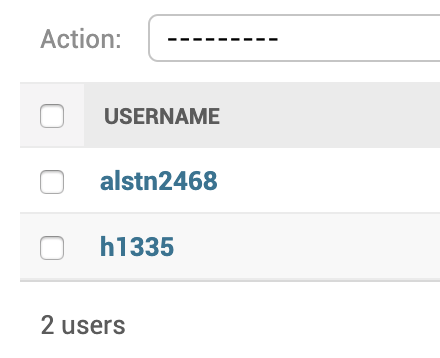
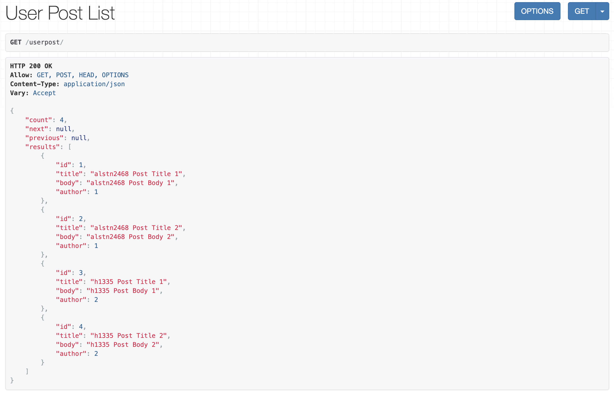
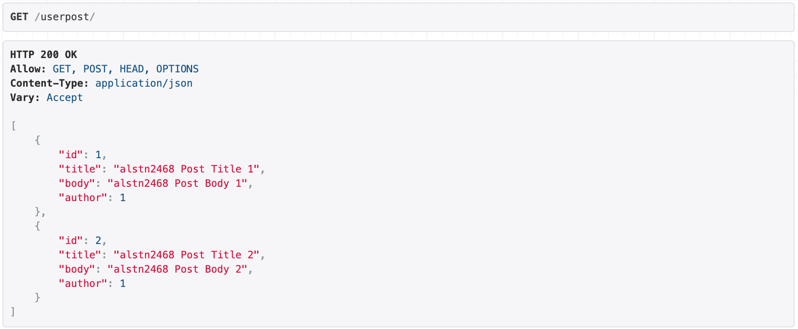
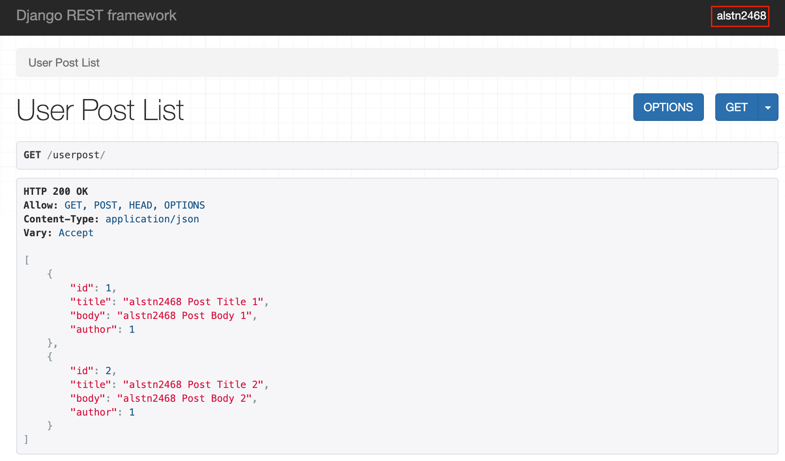
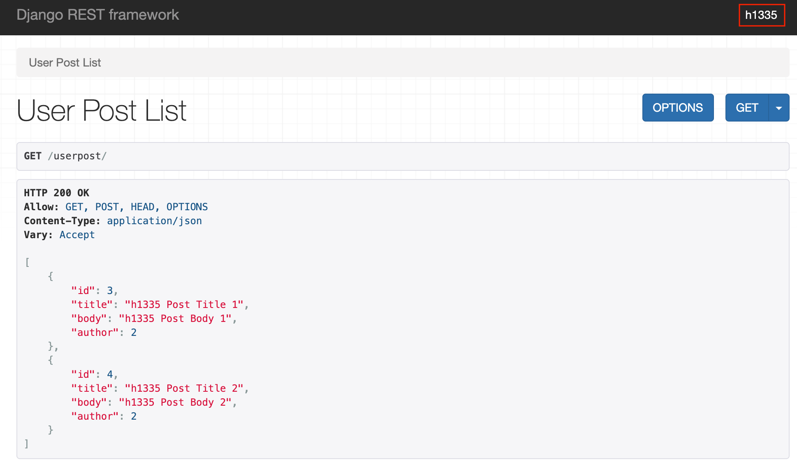
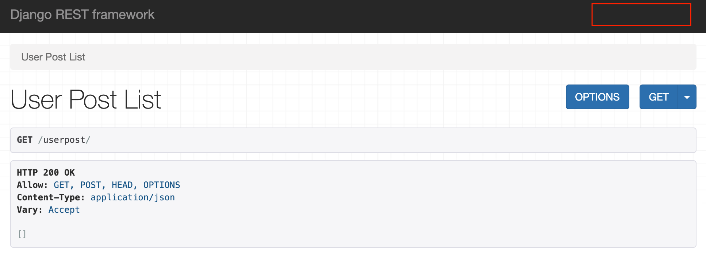
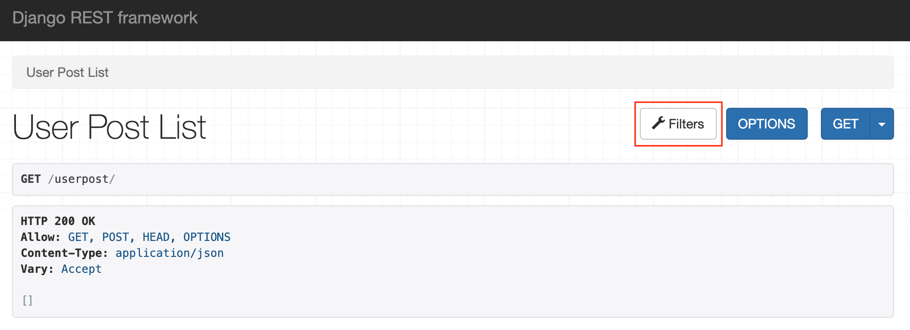
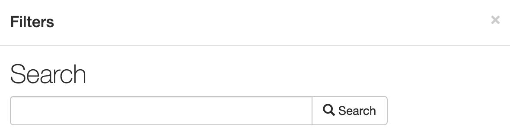
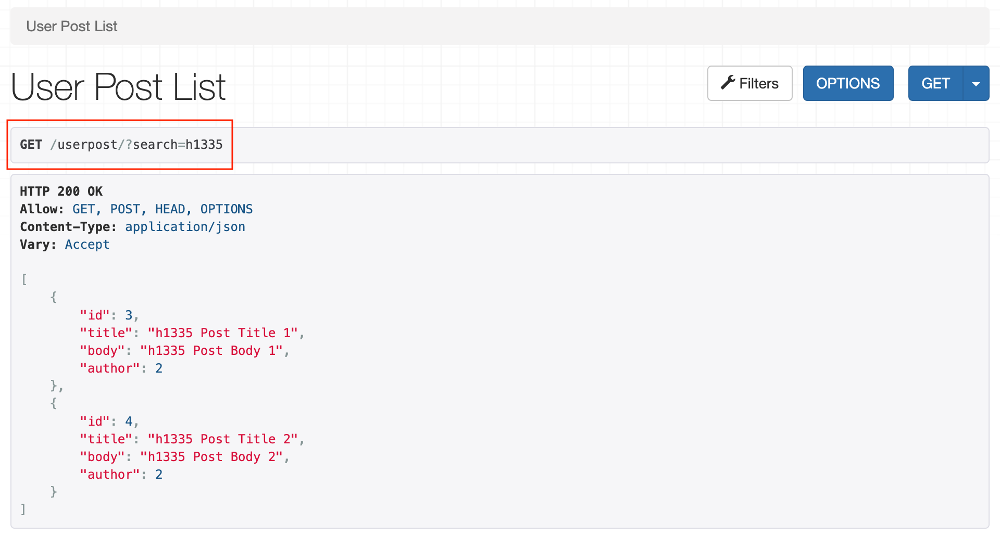

## 4주차 - 2. filtering and search

### Filtering vs Search

|             Filtering              |                    Search                     |
| :--------------------------------: | :-------------------------------------------: |
|       **Request** 걸러보내기       |             **Request** 걸러받기              |
| 특정 조건으로 생성된 **객체 요청** | 전달 받은 **객체**에서 특정 조건으로 **검색** |

### 보낸 Request 참조하기

-   보낸 `Request`

```python
my_request = self.request
```

-   보낸 `Request`의 `user`

```python
my_request_user = self.request.user
```

-   보낸 `GET Request`

```python
my_get_request = self.request.GET
my_get_request = self.request.query_param
```

-   보낸 `POST Request`

```python
my_post_request = self.request.POST
```

### Filtering & Search 구현하기

#### 1. 기본 준비 하기

이전과 동일하게 `Post`모델 생성 및 `REST API`기능 작성<br>

-   `settings.py` (프로젝트)
-   `models.py` (앱)
-   `admin.py` (앱)
-   `migrate` 명령어 실행
-   `serializer.py` (앱)
-   `views.py` (앱)
-   `urls.py` (앱, 프로젝트)

#### 2. 새로운 앱 생성 및 세팅

**사용자 개념**을 사용하기 위해 새로운 모델을 위한 앱 생성<br>

```
python manage.py startapp <userpost>
```

#### 3. urls.py 설정

-   프로젝트 폴더의 `urls.py`

```python
from django.contrib import admin
from django.urls import path, include
import post.urls
import userpost.urls

urlpatterns = [
    path('admin/', admin.site.urls),
    path('post', include(post.urls)),
    path('userpost', include(userpost.urls))
]
```

-   앱 폴더의 `urls.py`

```python
from rest_framework.routers import DefaultRouter
from django.urls import include, path
from .views import UserPostViewSet

router = DefaultRouter()
router.register('', UserPostViewSet)

urlpatterns = [
    path('', include(router.urls))
]
```

#### 4. serializer.py 생성 및 작성

```python
from .models import UserPost
from rest_framework import serializers


class UserPostSerializer(serializers.ModelSerializer):
    class Meta:
        model = UserPost
        fields = "__all__"
```

#### 5. models.py 작성

기존의 `Post`모델과 다르게 `author`라는 **사용자 개념**이 추가되었다.<br>
`Django`내부의 `AUTH_USER_MODEL`을 사용하기위해 `settings`를 추가하였고<br>
1번 항목부터 사용하기 때문에 `default`를 `1`로 지정하였다.<br>
`on_delete`는 **외부키**를 사용하기 위해 반드시 사용해야한다.<br>

```python
from django.db import models
from django.conf import settings


class UserPost(models.Model):
    title = models.CharField(max_length=100)
    body = models.TextField()
    author = models.ForeignKey(settings.AUTH_USER_MODEL,
                               default=1,
                               on_delete=models.CASCADE)
```

#### 6. migrate 및 user 생성

-   `migrate` 명령어

```
python manage.py makemigration
python manage.py migrate
```

-   `user` 생성하기

```
python manage.py createsuperuser
```

<br>
실습을 진행하기 위해서 **최소 2명**의 사용자가 필요하다.<br>
따라서 `alstn2468`과 `h1335`로 두 명의 사용자를 생성했다.<br>

#### 7. views.py 작성하기

```python
from .models import UserPost
from .serializer import UserPostSerializer
from rest_framework import viewsets


class UserPostViewSet(viewsets.ModelViewSet):
    queryset = UserPost.objects.all()
    serializer_class = UserPostSerializer
```

### Filtering 구현하기

구현하기 전 아래와 같이 각각의 `user`로 몇개의 글을 생성했다.<br>
<br>

#### 1) 쿼리셋 조작하기

아래와 같이 클래스 내부에 `get_queryset`함수를 구현하여 사용한다.<br>
`super`를 사용해 **부모 클래스**의 `get_queryset`함수로 **쿼리셋**을 가져온다.<br>

```python
def get_queryset(self):
        qs = super().get_queryset()

        return qs
```

#### 2) 쿼리셋 필터링하기

`filter`, `exclude`와 같은 매서드를 사용한다.<br>
사용자(`autor`)를 이용해 필터링하기 위해 아래와 같이 작성한다.<br>

```python
def get_queryset(self):
        qs = super().get_queryset()
        qs = qs.filter(author__id=1)

        return qs
```

위와 같이 작성한 후 `127.0.0.1:8000/userpost/`에 접속하면<br>
`author`의 값이 `1`인 객체만 보여지는 것을 확인할 수 있다.<br>

<br>

지금 **로그인한 사용자**의 글로 필터링하기 위해서는 아래와 같이 작성한다.<br>

```python
def get_queryset(self):
        qs = super().get_queryset()
        qs = qs.filter(author=self.request.user)

        return qs
```

-   `alstn2468`로 로그인 되었을 때

<br>

-   `h1335`로 로그인 되었을 때

<br>

현재 **로그인 되어 있는 사용자**가 **생성한 객체**를 잘 가져오는 것을 볼 수 있다.<br>

#### 완성도 높이기

**로그인하지않고** 해당 API를 사용하려고하면 `Anonymous User`로<br>
접근하게 되어 **에러**가 **발생**하는 것을 확인할 수 있다.<br>
따라서 **로그인 되어있다면** 로그인한 **유저의 쿼리셋**을 반환하고<br>
**로그인이 되어있지 않다면** **비어있는 쿼리셋**을 반환하도록 하면된다.<br>

```python
def get_queryset(self):
        qs = super().get_queryset()

        if self.request.user.is_authenticated:
            qs = qs.filter(author=self.request.user)

        else:
            qs = qs.none()

        return qs
```

아래와 같이 **로그인되지 않은 상황**에서는 **빈 쿼리셋**이 반환된다.<br>

<br>

### Search 구현하기

`rest_framework`에 구현되어있는 `SearchFilter`를 사용하면 된다.<br>

```python
from rest_framework.filters import SearchFilter
```

작성된 `ViewSet`에 `filter_backends`, `search_fields`를 지정하면 된다.<br>
`filter_backends`는 어떤 클래스를 기반으로 검색을 진행할 것인지 적어주고<br>
`search_fields`는 어떤 칼럼을 기반으로 검색할 것인지 적으면 된다.<br>

```python
filter_backends = [SearchFilter]
search_fields = ('title',)
```

#### 총 작성된 views.py

```python
from .models import UserPost
from .serializer import UserPostSerializer
from rest_framework import viewsets
from rest_framework.filters import SearchFilter


class UserPostViewSet(viewsets.ModelViewSet):
    queryset = UserPost.objects.all()
    serializer_class = UserPostSerializer

    filter_backends = [SearchFilter]
    search_fields = ('title',)

    def get_queryset(self):
        qs = super().get_queryset()

        if self.request.user.is_authenticated:
            qs = qs.filter(author=self.request.user)

        else:
            qs = qs.none()

        return qs
```

#### Search 테스트 하기

위와 같이 코드를 작성하고 `127.0.0.1:8000/userpost/`로 들어가면<br>
아래와 같이 `Filters`버튼이 추가된 것을 볼 수 있다.<br>

<br>

버튼을 누르면 아래와 같은 검색창이 하나 뜨는 것을 확인할 수 있다.<br>

<br>

입력칸을 `h1335`로 작성 후 검색 버튼을 누르면 아래와 같은 결과가 나온다.<br>

<br>

`search_fields`에 검색할 때 사용하고 싶은 필드를 추가하고 싶다면<br>
아래와 같이 `search_fields` 튜플에 아래와 같이 값만 추가해 주면 된다.<br>

```python
search_fields = ('title', 'body')
```
