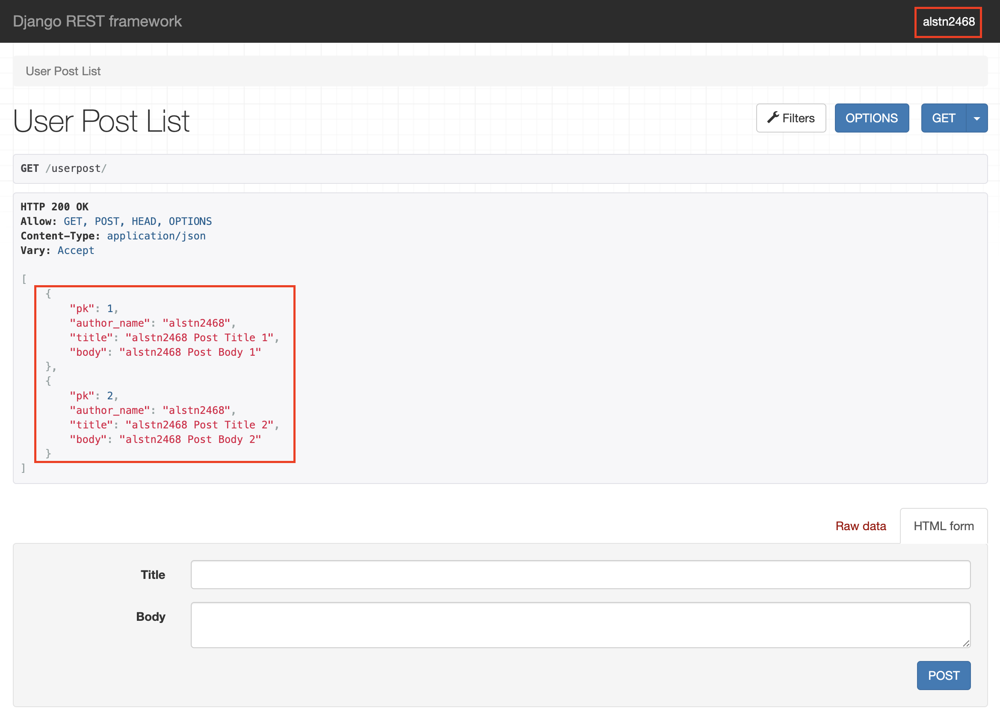
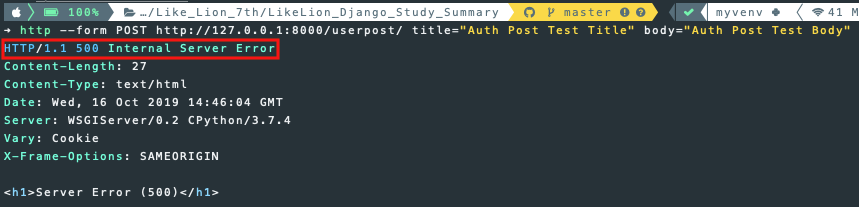
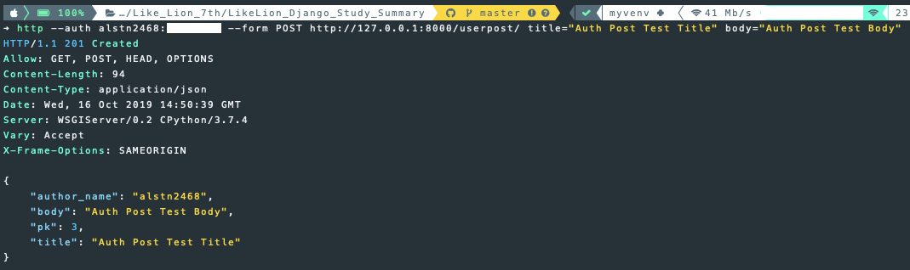

## 4주차 - 3. Authentication

### Authentication & Permission

API 서버의 **동작 원리**

-   **C**reate
-   **R**ead
-   **U**pdate
-   **D**elete

API 서버의 **운영 원리**

-   **Auth**entication
    -   서비스를 이용할 때 사용자가 어느 정도의 **권한**이 있음을 **요청**하는 과정
-   **Permission**
    -   서비스를 **어느 정도로 이용**할 수 있는지에 대한 **권한**<br>

대부분의 웹 서비스에서 **모든 사용자**에게 **동일한 권한을 주지 않는다**.<br>

### Authentication

인증 요청이 왔을 때 인증이 성공을 할 경우와 실패할 경우 모두<br>
`request.user`와 `request.auth` 두 개의 변수가 생성된다.<br>

#### 인증에 성공했을 때

인증이 성공할 경우 유저의 대표값인 아이디가 `request.user`에 저장되고<br>
인증을 성공한 유저의 권한이 `request.auth`에 저장된다.<br>

#### 인증에 실패했을 때

인증이 실패한 경우 `AnonymousUser`가 `request.user`에 저장되고<br>
`request.auth`는 `None`값을 가지고 있게 된다.<br>
인증에 실패했을 경우 기본 설정과 다르게 다른 값을 전달하고 싶다면<br>
`settings.py`에서 `UNAUTHENTICATED_USER`와 `UNAUTHENTICATED_TOKEN`값을 수정하면 된다.<br>

### 전역으로 인증 설정하기

`settings.py`에 `REST_FRAMEWORK` 딕셔너리를 생성하고 아래와 같이<br>
기본 값으로 사용하길 원하는 **인증 방식**을 작성하면 된다.<br>

```python
REST_FRAMEWORK = {
    'DEFAULT_AUTHENTICATION_CLASSES': [
        'rest_framework.authentication.BasicAuthentication',
        'rest_framework.authentication.SessionAuthentication',
    ]
}
```

### View별로 인증 설정하기

`rest_framework`의 `authentication`에서 사용할 **인증 방식**을 `import`해주고<br>
`authentication_classes`리스트에 추가한 **인증 방식**을 작성하면 된다.<br>

```python
from rest_framework.authentication import SessionAuthentication, BasicAuthentication
from rest_framework.permissions import IsAuthenticated
from rest_framework.response import Response
from rest_framework.views import APIView

class ExampleView(APIView):
    authentication_classes = [SessionAuthentication, BasicAuthentication]
    permission_classes = [IsAuthenticated]

    def get(self, request, format=None):
        content = {
            'user': unicode(request.user),
            'auth': unicode(request.auth),
        }
        return Response(content)
```

### Function Based View에서 인증 설정하기

**데코레이터**(`@`)를 사용해 구현하며 아래와 같이 `@authentication_classes`에
위의 `CBV`에서 사용했던 것과 마찬 가지로 사용할 **인증 방식**을 작성하면 된다.<br>

```python
@api_view(['GET'])
@authentication_classes([SessionAuthentication, BasicAuthentication])
@permission_classes([IsAuthenticated])
def example_view(request, format=None):
    content = {
        'user': unicode(request.user),
        'auth': unicode(request.auth),
    }
    return Response(content)
```

### Django rest framework에서의 인증

#### 인증되지 않은 요청이나 허가되지 않은 요청

-   `HTTP 401 Unauthorized`
-   `HTTP 403 Permission Denied`

#### Authentication 종류

-   `BasicAuthentication`
-   `TokenAuthentication`
-   `SessionAuthentication`
-   `RemoteUserAuthentication`
-   `Custom authentication`

#### BasicAuthentication

`HTTP Protocol`자체 **기본 인증**에 **기반**한 인증 방식<br>
`HTTP` 제어 헤더로 넘긴 `ID`, `PW`를 **base64**로 **인코딩**한다.<br>

#### TokenAuthentication

`BasicAuthentication`을 보완한 방식<br>
사용자가 **인증**을 **요청**하면 해당 사용자에게 **유일한 Key 값**을 발급한다.<br>
**Token 헤더**에서 인증을 수행한다.<br>

#### SessionAuthentication

로그인이 될 때마다 저장되는 `Session`정보를 참조하여 인증한다.<br>

#### RemoteUserAuthentication

사용자 정보가 **다른 서비스에서 관리**될 때 쓰이는 인증 방식이다.<br>
**REMOTE_USER 헤더**에서 인증을 수행한다.

### Authentication 구현하기

#### 1. 기본 앱 구성하기

이전 강의에서 진행했던 `UserPost`모델을 사용한 프로젝트를 사용합니다.<br>

1. 프로젝트 생성 및 앱 생성
2. `settings.py` 작성
3. `models.py` 작성 및 `admin.py` 연결
4. `migrate` 명령어 실행
5. `serializer.py` 작성
6. `views.py` 작성
7. 앱의 `urls.py`작성 및 프로젝트의 `urls.py`와 연결

#### 2. author 필드 ReadOnly로 바꾸기

`serializer.py`를 아래와 같이 수정한다.<br>

```python
class UserPostSerializer(serializers.ModelSerializer):

    author_name = serializers.ReadOnlyField(
        source='author.username'
    )

    class Meta:
        model = UserPost
        fields = ['pk','author_name', 'title', 'body']
```

아래와 같이 설정한 필드가 잘 보이는 것을 확인할 수 있다.<br>
또한 `author`를 **ReadOnly**로 변경해 선택하는 `Form`이 사라졌다.<br>

<br>

#### 3. 인증 과정 구현하기

`views.py`에서 `perform_create`라는 함수를 이용해 구현한다.<br>
`serializer`의 `save`함수를 이용해 `author`필드를 `self.request.user`로 저장한다.<br>

```python
class UserPostViewSet(viewsets.ModelViewSet):
    queryset = UserPost.objects.all()
    serializer_class = UserPostSerializer

    filter_backends = [SearchFilter]
    search_fields = ('title', 'body')

    def get_queryset(self):
        qs = super().get_queryset()

        if self.request.user.is_authenticated:
            qs = qs.filter(author=self.request.user)

        else:
            qs = qs.none()

        return qs

    def perform_create(self, serializer):
        serializer.save(author=self.request.user)
```

#### 4. settings.py 수정하기

아래와 같이 `settings.py`를 수정해준다.<br>

```python
DEBUG = False
ALLOWED_HOSTS = ['*']
```

#### 5. 인증 방식 등록하기

위에서 설명한 것과 같이 두 가지 방법으로 등록이 가능하다.<br>

-   전역으로 인증 방식 등록하기

```python
REST_FRAMEWORK = {
    'DEFAULT_AUTHENTICATION_CLASSES': [
        'rest_framework.authentication.BasicAuthentication',
        'rest_framework.authentication.SessionAuthentication',
    ]
}
```

-   `views.py`에서 인증 방식 등록하기

```python
...
from rest_framework.authentication \
    import BasicAuthentication, SessionAuthentication


class UserPostViewSet(viewsets.ModelViewSet):
    authentication_classes = [BasicAuthentication, SessionAuthentication]
    queryset = UserPost.objects.all()
    serializer_class = UserPostSerializer
    ...
```

#### httpie로 테스트하기

-   이전과 같이 `POST`요청 보내기

<br>

이전과 같이 `POST`요청을 보낼경우 `HTTP 500 Server Error`가 발생한다.<br>
왜냐하면 요청을 보낸 사용자가 누구인지 모르기 때문이다.<br>

-   인증 정보와 함께 `POST`요청 보내기

```
http --auth <username>:<password> --form POST http://127.0.0.1:8000/userpost/ title="" body=""
```

<br>

위와 같이 `POST`요청이 잘 처리되는 것을 확인할 수 있다.<br>
