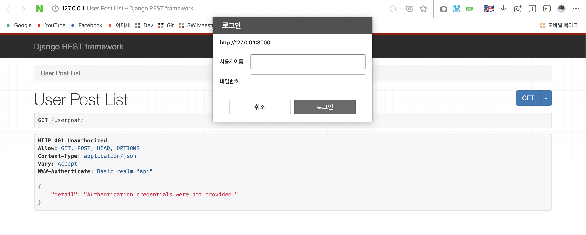
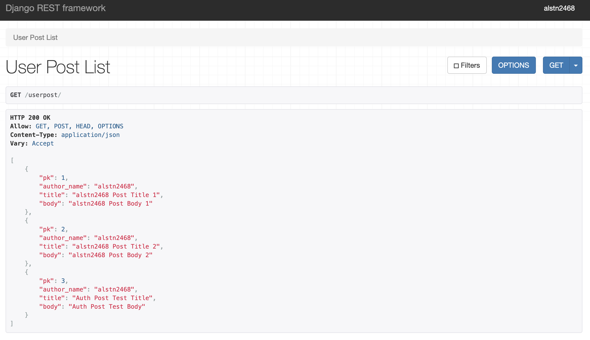
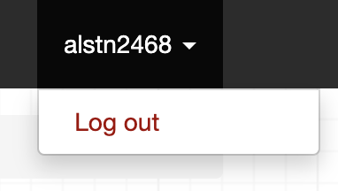
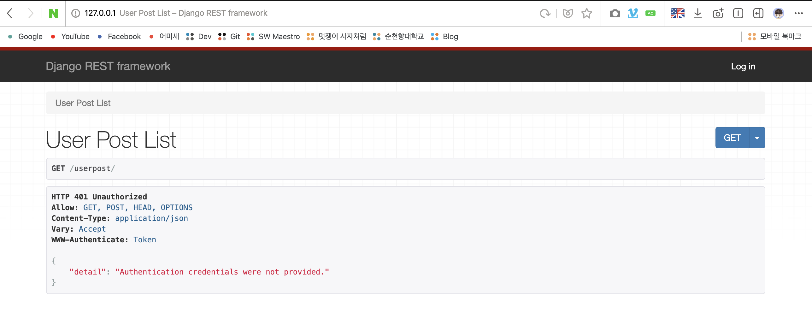
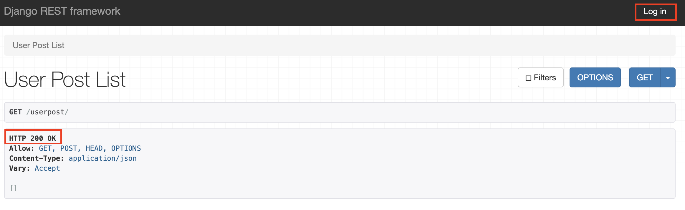
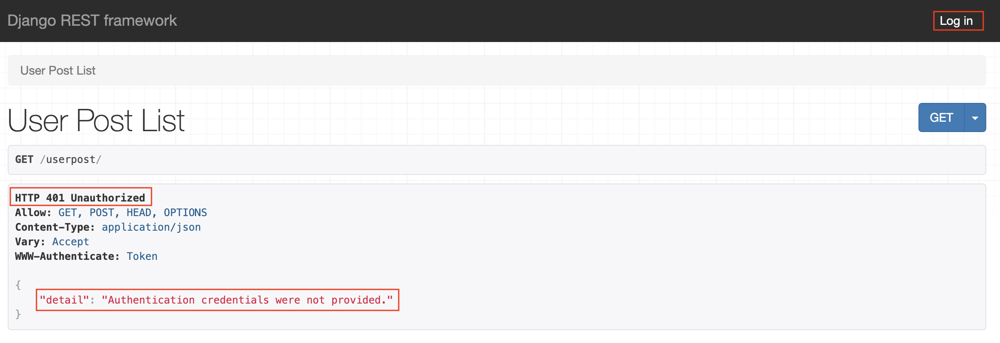
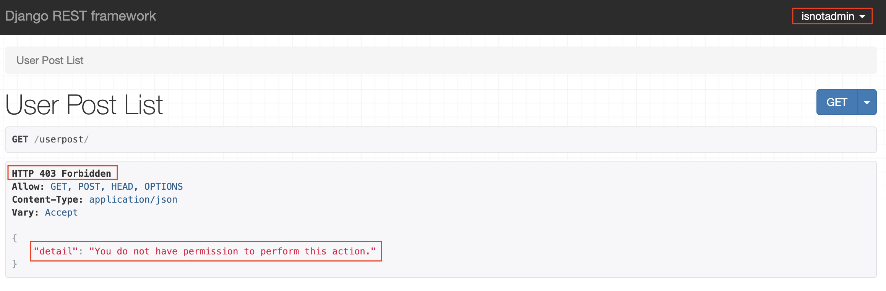

## 4주차 - 4. permission

### Permission

**View 호출** 시 **가장 먼저** 확인하는 것<br>
**인증 정보**를 **기반**으로 **권한**을 **확인**한다.<br>
`request.user`, `request.auth`를 기반으로 권한 확인<br>

### Permission 설정

`authentication`과 `pagination`과 동일하게 두가지 방법이 존재한다.<br>

-   settings.py에서 전역 설정
-   각 views.py에서 설정

#### 1. 전역으로 Permission 설정하기

아래와 같이 `settings.py`에 `DEFAULT_PERMISSION_CLASSES`를 설정한다.<br>

```python
REST_FRAMEWORK = {
    'DEFAULT_PERMISSION_CLASSES': [
        'rest_framework.permissions.IsAuthenticated',
    ]
}
```

#### 2. views.py에서 설정하기

각각의 `views.py`에서 설정을 하기위해서는 사용할 `permissions`모듈을 추가하고<br>
작성한 `ViewSet`의 `permission_classes`리스트에 추가한 모듈을 넣어주면 된다.<br>

```python
from rest_framework.permissions \
    import IsAuthenticatedOrReadOnly, IsAdminUser

class UserPostViewSet(viewsets.ModelViewSet):
    ...
    permission_classes = [IsAuthenticatedOrReadOnly]
    ...
```

또한 아래와 같이 `Function Based View`에서 **데코레이터**(`@`)를 이용할 수 있다.<br>

```python
from rest_framework.permissions import IsAuthenticated

@api_view(['GET'])
@permission_classes([IsAuthenticated])
def user_post_view(request, format=None):
    ...
```

### Permission Class

-   `AllowAny` (default)
    -   인증된 요청, 비인증된 요청 **모두 허용**
-   `IsAuthenticated`
    -   **인증된 요청**에 대해서만 View 호출 **허용**
-   `isAdminUser`
    -   **Staff User**에 대해서만 요청 **허용**
    -   `(User.is_staff == True)`일 경우 **허용**
-   `IsAuthenticatedOrReadOnly`
    -   **비인증 요청**에 대해서는 **읽기**만 **허용**
-   etc
    -   `DjangoModelPermissions`
    -   `DjangoModelPermissionsOrAnonReadOnly`
    -   `DjangoObjectPermissions`

### Permission 구현하기

이전 강의에서 구현한 `Authentication`프로젝트에 추가로 구현<br>

#### 1. 전역으로 Permission 설정하기

`settings.py`에 아래와 같이 `REST_FRAMEWORK`딕셔너리에<br>
적용하고 싶은 `Permission Class`를 리스트 형식으로 작성하면 된다.<br>

```python
REST_FRAMEWORK = {
    'DEFAULT_AUTHENTICATION_CLASSES': [
        'rest_framework.authentication.BasicAuthentication',
        'rest_framework.authentication.SessionAuthentication',
    ],
    'DEFAULT_PERMISSION_CLASSES': [
        'rest_framework.permissions.IsAuthenticated',
    ]
}
```

#### 2. views.py에 Permission 설정하기

`rest_framework.permissions`에서 사용할 `Permission Class`를 추가하고<br>
작성한 **ViewSet**에 `permission_classes`를 **리스트**로 추가하면 된다.<br>

```python
...
from rest_framework.permissions \
    import AllowAny, IsAuthenticated, IsAuthenticatedOrReadOnly, IsAdminUser

class UserPostViewSet(viewsets.ModelViewSet):
    authentication_classes = [BasicAuthentication, SessionAuthentication]
    permission_classes = [IsAuthenticated]

    queryset = UserPost.objects.all()
    serializer_class = UserPostSerializer
    ...
```

### 작성한 Permission 테스트하기

로그인하지 않은 상태로 `127.0.0.1:8000/userpost`에 접속하면<br>
아래와 같이 로그인 창이 팝업으로 뜨는 것을 확인할 수 있다.<br>
인증 정보를 바탕으로 `Permission Class`를 지정해야하는데<br>
로그인 되어있지 않은 상태이기 때문에 사용자에게 **로그인을 요청**한다.<br>
`BasicAuthentication`이 적용되어 있기 때문에 브라우저에서 로그인창을 띄워준다.<br>

<br>

로그인에 성공하면 아래와 같이 해당 계정으로 생성한 객체가 보여진다.<br>

<br>

### API서버 내부에 로그인 페이지 만들기

지금까지는 `admin`페이지로 이동해 로그인, 로그아웃을 한 후 테스트를 진행했다.<br>
매우 번거로운 과정이기 때문에 보여지는 페이지 내부에 기능을 생성한다.<br>

```python
from django.contrib import admin
from django.urls import path, include
import userpost.urls
import rest_framework.urls

urlpatterns = [
    path('admin/', admin.site.urls),
    path('userpost/', include(userpost.urls)),
    path('api-auth/', include(rest_framework.urls))
]
```

위와 같이 `rest_framework.urls`를 추가한 후 `api-auth`를 `path`에 추가한다.<br>
그러면 아래와 같이 로그아웃 버튼이 생긴 것을 확인이 가능하다.<br>

<br>

그러나 현재는 `BasicAuthentication`이 적용되어 있어 로그아웃이 되지 않는다.<br>
`BasicAuthentication`을 `TokenAuthentication`으로 바꾸어 실행해보자.<br>

```python
...
from rest_framework.authentication \
    import SessionAuthentication, TokenAuthentication
...


class UserPostViewSet(viewsets.ModelViewSet):
    authentication_classes = [TokenAuthentication, SessionAuthentication]
    ...
```

<br>

위와 같이 로그인과 로그아웃이 잘 되는 것을 확인할 수 있다.<br>

### 다른 Permission 테스트하기

#### IsAuthenticatedOrReadOnly

아래와 같이 `permission_classes`를 `IsAuthenticatedOrReadOnly`로 바꾸고 테스트해보자.<br>

```python
...
from rest_framework.permissions \
    import AllowAny, IsAuthenticated, IsAuthenticatedOrReadOnly, IsAdminUser


class UserPostViewSet(viewsets.ModelViewSet):
    authentication_classes = [TokenAuthentication, SessionAuthentication]
    permission_classes = [IsAuthenticatedOrReadOnly]
    ...
```

이전에 `IsAuthenticated`를 적용했을 때 로그인이 되어있지 않으면<br>
`HTTP 401 Unauthorized` 권한이 없다는 **Response**를 받을 수 있엇다.<br>
하지만 `IsAuthenticatedOrReadOnly`를 적용하면 `HTTP 200 OK`를 응답으로 받는다.<br>

<br>

#### IsAdminUser

아래와 같이 `permission_classes`를 `IsAdminUser`로 바꾸고 테스트해보자.<br>

```python
...
from rest_framework.permissions \
    import AllowAny, IsAuthenticated, IsAuthenticatedOrReadOnly, IsAdminUser


class UserPostViewSet(viewsets.ModelViewSet):
    authentication_classes = [TokenAuthentication, SessionAuthentication]
    permission_classes = [IsAdminUser]
    ...
```

-   로그인 되어 있지 않을 경우 (`HTTP 401 Unauthorized`)

<br>

-   관리자 권한일 경우 (`HTTP 200 OK`)

<br>

-   관리자 권한이 아닐 경우 (`HTTP 403 Forbidden`)

<br>
