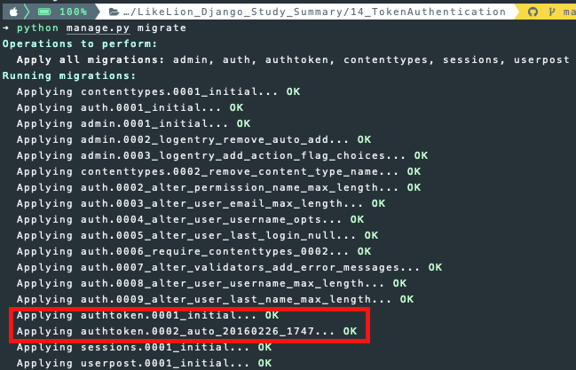
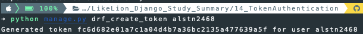
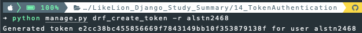
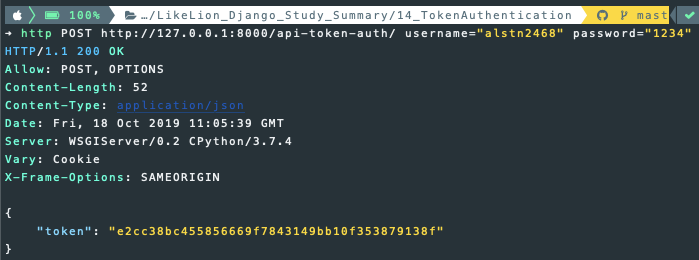
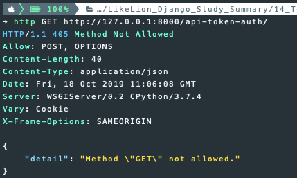
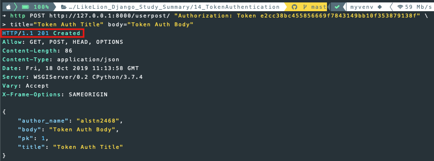
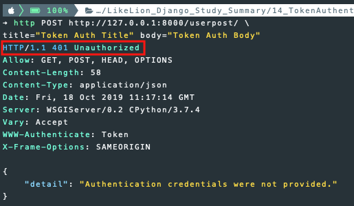

## 4주차 - 5. token인증

### Token Authentication

`BasicAuthentication` : 보안이 취약할 수 있다.<br>
`SessionAuthentication` : 외부 서비스에서 사용 불가능 하다.<br>

따라서 `TokenAuthentication`을 많이 사용하며 **Mobile Client**에 적합하다.<br>

#### 수행과정

1. username, password와 **1:1 매칭**되는 **고유 key** 생성, 발급
2. 발급받은 `Token`을 API요청에 담아 **인증**처리

### Token Authentication 설정하기

기존의 인증 방식과 다르게 하나의 단계를 더 거쳐야한다.<br>
`settings.py`의 `INSTALLED_APPS`에 아래와 같이<br>
`rest_framework.authtoken`을 추가하고 `migrate` 명령어를 실행해 주어야 한다.<br>

```python
INSTALLED_APPS = [
    ...
    'rest_framework',
    'rest_framework.authtoken',
    ...
]
```

`migrate` 명령어를 실행시키는 것으로 보아 **모델**과 연관이 있다.<br>

#### Token 모델 클래스

`rest_framework`내부의 `authtoken`앱의 `models.py`에 있는 `Token`클래스다.<br>
`OneToOneField`를 이용해 **하나의 사용자**에 **하나의** `Token`을 발급한다.<br>

```python
class Token(models.Model):
    """
    The default authorization token model.
    """
    key = models.CharField(_("Key"), max_length=40, primary_key=True)
    user = models.OneToOneField(
        settings.AUTH_USER_MODEL, related_name='auth_token',
        on_delete=models.CASCADE, verbose_name=_("User")
    )
    created = models.DateTimeField(_("Created"), auto_now_add=True)
```

### Token 생성하기

`User Instance`를 생성하면 `Token`이 자동으로 생성되는 것은 아니다.<br>

#### Token을 생성하는 방법

1. `authtoken`앱의 `views.py`의 `ObtainAuthToken`을 이용해 생성

`ObtainAuthToken`의 코드는 [여기](https://github.com/encode/django-rest-framework/blob/master/rest_framework/authtoken/views.py)에서 확인할 수 있다.<br>

2. `Python` 명령어를 통한 생성

**토큰 생성하기**

```python
python manage.py drf_create_token <username>
```

**토큰 강제로 재생성하기**

```python
python manage.py drf_create_token -r <username>
```

3. `signal`을 이용한 사용자 생성시 `Token`생성

`signal`은 **특정 동작**이 **발생**했을 때 **처리될 동작**을 **지정**할 수 있도록 한다.<br>
아래에서 사용한 `post_save`는 **DB**에 **정보**가 **저장된 직후**에 특정 동작이 **수행**된다.<br>

```python
from django.conf import settings
from django.db.models.signals import post_save
from django.dispatch import receiver
from rest_framework.authtoken.models import Token

@receiver(post_save, sender=settings.AUTH_USER_MODEL)
def create_auth_token(sender, instance=None, created=False, **kwargs):
    if created:
        Token.objects.create(user=instance)
```

새 사용자가 생성될 때 마다 `settings.AUTH_USER_MODEL`로 `signal`을 보낸다.
`user`와 **1:1 매칭**되는 토큰을 생성해 `AUTH_USER_MODEL`로 보내준다.<br>

#### 생성한 Token을 획득하는 방법

`Token`을 획득할 수 있는 `URL Path`를 지정하고 그 `URL`에 `POST`요청을 보내 `Token`을 획득한다.<br>
`obtain_auth_token`은 `Token`을 생성할 때 사용한 `ObtainAuthToken`에 `as_view`를 붙인것이다.<br>
아래와 같이 `urls.py`에 추가해주고 그 `URL`에 `POST`요청을 보내면 된다.<br>

```python
...
from rest_framework.authtoken.views import obtain_auth_token

urlpatterns = [
    path('api-auth/', include(rest_framework.urls)),
    path('api-token-auth/', obtain_auth_token),
]
```

#### 발급받은 Token을 API요청에 담아 인증처리

-   인증 성공시

```python
request.user = <Django User Instance>
request.auth = <rest_framework.authtoken.models.BasicToken Instance>
```

### TokenAuthentication 구현하기

`Authentication`, `Permission` 강의에 사용한 프로젝트와 동일<br>

#### 1. settings.py 수정하기

```python
INSTALLED_APPS = [
    ...
    'rest_framework',
    'rest_framework.authtoken',
    'userpost.apps.UserpostConfig',
]
```

#### 2. migrate 실행하기

```python
python manage.py makemigrations
python manage.py migrate
```

아래와 같이 `authtoken` 모델도 적용되었다.<br>

<br>

#### 3. views.py 수정하기

`settings.py`에서 **전역**으로 적용하는 방법도 존재한다.<br>

```python
...
from rest_framework.authentication import TokenAuthentication
from rest_framework.permissions import IsAuthenticatedOrReadOnly


class UserPostViewSet(viewsets.ModelViewSet):
    authentication_classes = [TokenAuthentication]
    permission_classes = [IsAuthenticatedOrReadOnly]
    ...
```

#### 4. 명령어로 Token 생성하기

```python
python manage.py drf_create_token <username>
```

아래와 같이 `Token`이 생성되는 것을 확인할 수 있다.<br>

<br>

토큰이 존재하는 상태에서 **재생성**하면 **동일한 토큰**이 **발급**된다.<br>
아래의 명령어를 사용하면 강제로 토큰을 재생성한다.<br>

```python
python manage.py drf_create_token -r <username>
```

아래와 같이 이전과 다른 토큰이 재생성된 것을 확인할 수 있다.<br>

<br>

#### 5. 생성된 토큰 획득하기

아래와 같이 프로젝트 폴더의 `urls.py`에 `obatin_auth_token`모듈을 추가해 사용한다.<br>
`obtain_auth_token`은 `POST`방식의 요청만 받는다.<br>

```python
from django.contrib import admin
from django.urls import path, include
from rest_framework.authtoken.views import obtain_auth_token
import userpost.urls
import rest_framework.urls

urlpatterns = [
    path('admin/', admin.site.urls),
    path('userpost/', include(userpost.urls)),
    path('api-auth/', include(rest_framework.urls)),
    path('api-token-auth/', obtain_auth_token)
]
```

#### 6. httpie 명령어로 토큰 획득하기

-   `POST`매서드로 요청

<br>

-   `GET`매서드로 요청

<br>

#### 7. 획득한 토큰으로 인증하기

`"Authorization: Token <Token>"`을 `httpie`명령어에 추가해 사용한다.<br>

-   `Request`에 `Token`을 추가해 보낼 경우

<br>

-   `Request`에 `Token`이 없을 경우

<br>
