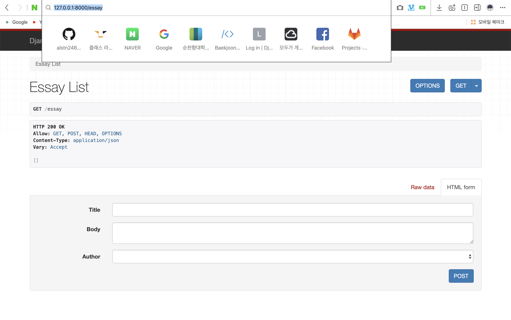
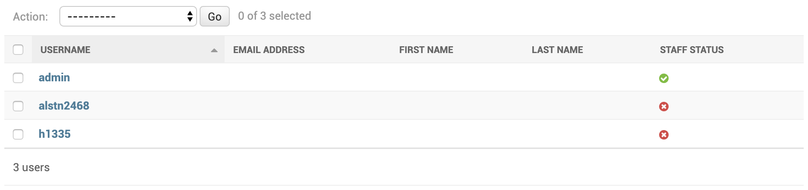
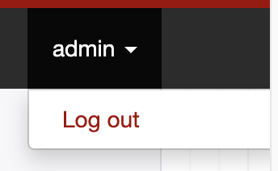
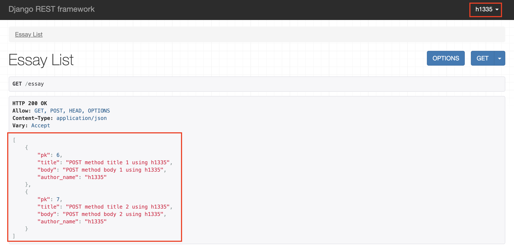
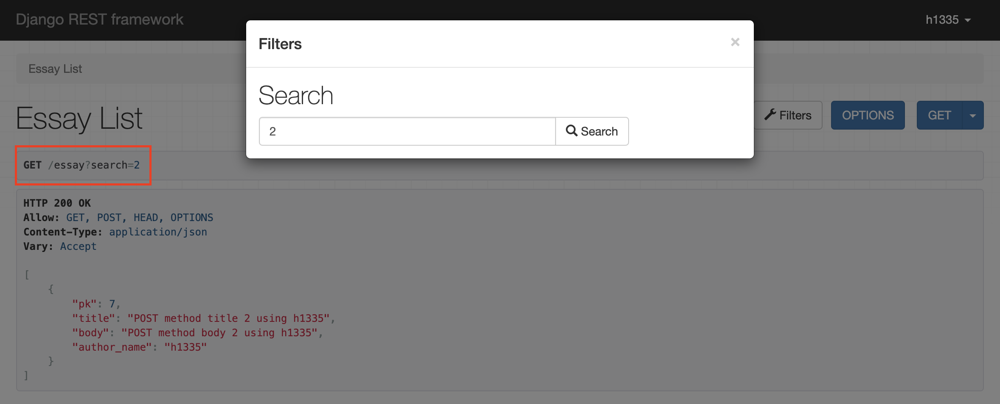

## 4주차 - 7. 프로젝트 실습 1

### 1. 프로젝트 생성

```
django-admin startproject <프로젝트 이름>
```

#### 2. 앱 생성

```
python manage.py startapp Album
python manage.py startapp Essay
python manage.py startapp File
```

### 3. settings.py에 앱 추가

```python
INSTALLED_APPS = [
    'django.contrib.admin',
    'django.contrib.auth',
    'django.contrib.contenttypes',
    'django.contrib.sessions',
    'django.contrib.messages',
    'django.contrib.staticfiles',
    'Album.apps.AlbumConfig',
    'Essay.apps.EssayConfig',
    'File.apps.FileConfig',
    'rest_framework',
    'rest_framework.authtoken',
]
```

### 4. Essay 앱에 urls.py 생성 및 연결

- 프로젝트 폴더의 `urls.py`

```python
from django.conf import settings
from django.contrib import admin
from django.urls import path, re_path, include
import Essay.urls

urlpatterns = [
    path('admin/', admin.site.urls),
    path('', include(Essay.urls))
]
```

- Essay 앱의 `urls.py`

```python
from rest_framework.routers import DefaultRouter
from django.urls import path, include
from Essay import views

router = DefaultRouter()
router.register('essay', views.EssayViewSet)

urlpatterns = [
    path('', include(router.urls))
]
```

### 5. Essay앱의 views.py 작성하기

```python
from rest_framework import viewsets
from .models import Essay
from .serializer import EssaySerializer


class EssayViewSet(viewsets.ModelViewSet):
    queryset = Essay.objects.all()
    serializer_class = EssaySerializer
```

### 6. Essay 모델 작성 및 migrate

```python
from django.db import models
from django.conf import settings


class Essay(models.Model):
    author = models.ForeignKey(
        settings.AUTH_USER_MODEL,
        default=1,
        on_delete=models.CASCADE
    )
    title = models.CharField(max_length=30)
    body = models.TextField()
```

### 7. Essay 앱 serializer 작성하기

```python
from .models import Essay
from rest_framework import serializers


class EssaySerializer(serializers.ModelSerializer):

    class Meta:
        model = Essay
        fields = "__all__"
```

###  8. Essay 앱 작동  테스트

`http://127.0.0.1:8000/essay`로 접속하면 잘 동작하는 것을 확인할 수 있다.<br>

<br>


### 9. 사용자 추가하기


<br>

앞으로의 테스트를 위해 관리자 `admin` 하나와<br>
일반 사용자 계정인 `alstn2468`와 `h1335`를 추가했다.<br>

### 10. author필드 Read Only로 변경하기

- Essay앱의 `serializer.py` 수정하기

```python
from .models import Essay
from rest_framework import serializers


class EssaySerializer(serializers.ModelSerializer):

    author_name = serializers.ReadOnlyField(
        source="author.username"
    )

    class Meta:
        model = Essay
        fields = ("pk", "title", "body")

```

- Essay앱의 `views.py` 수정하기

```python
from rest_framework import viewsets
from .models import Essay
from .serializer import EssaySerializer


class EssayViewSet(viewsets.ModelViewSet):
    queryset = Essay.objects.all()
    serializer_class = EssaySerializer

    def perform_create(self, serializer):
        serializer.save(author=self.request.user)
```

`POST`요청을 보내는 폼에서 `author`가 사라진 것을 확인할 수 있다.<br>

<br>

### 11. 로그인 로그아웃 버튼 구현하기

프로젝트 폴더의 `urls.py`를 아래와 같이 수정한다.<br>

```python
...
import rest_framework.urls
...

urlpatterns = [
    ...
    path('api-auth/', include(rest_framework.urls))
]
```

로그아웃 버튼이 생성된 것이 확인 가능하다.<br>

<br>

### 12. 사용자 기준 Filtering 구현하기

Essay앱의 `EssayViewSet`을 아래와 같이 수정한다.<br>

```python
class EssayViewSet(viewsets.ModelViewSet):
    queryset = Essay.objects.all()
    serializer_class = EssaySerializer

    def perform_create(self, serializer):
        serializer.save(author=self.request.user)

    def get_queryset(self):
        qs = super().get_queryset()

        if self.request.user.is_authenticated:
            qs = qs.filter(author=self.request.user)

        else:
            qs = qs.none()

        return qs
```

아래와 같이 **로그인되어 있는 사용자**로 생성된 객체들만 보여지게 된다.<br>

<br>

### 13. Search 구현하기

`rest_framework`의 `filters`의 `SearchFilter`를 추가하고<br>
`filter_backends`와 `search_fields`를 아래와 같이 설정한다.<br>

```python
...
from rest_framework.filters import SearchFilter


class EssayViewSet(viewsets.ModelViewSet):
    ...
    filter_backends = [SearchFilter]
    search_fields = ("title", "body")
    ...
```

아래처럼 검색이 가능한 버튼이 생성되었으며 잘 작동하는 것을 볼 수 있다<br>

<br>
