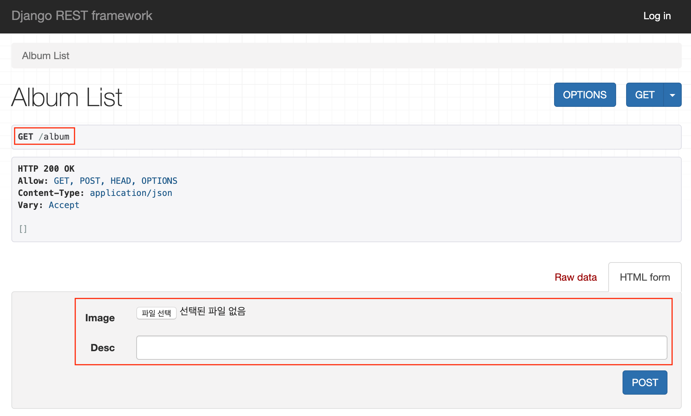
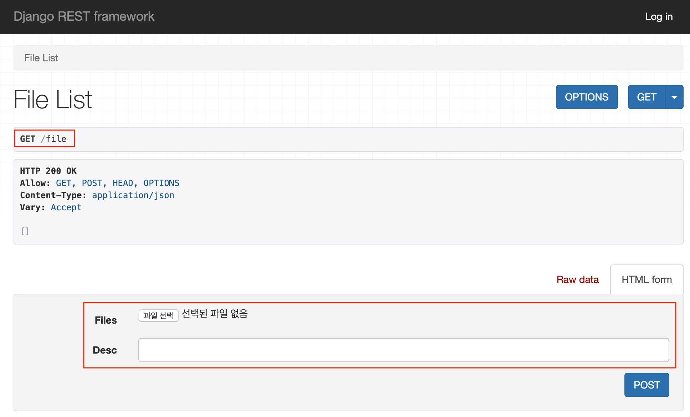
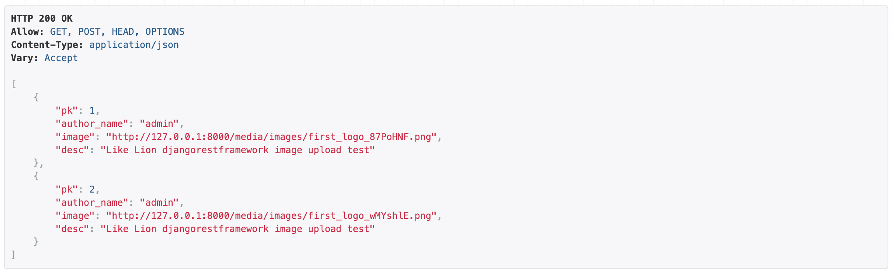
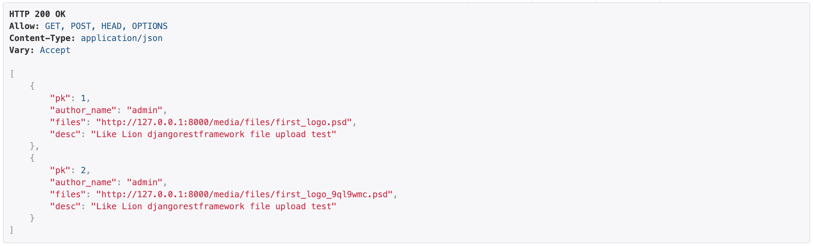
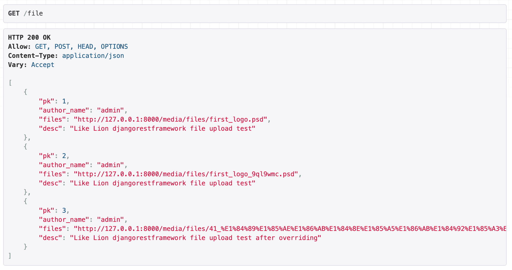

## 4주차 - 8. 프로젝트 실습 2

### 14. 미디어 파일 설정하기

`settings.py`에 아래와 같이 추가해준다.<br>

```python
MEDIA_URL = '/media/'
MEDIA_ROOT = os.path.join(BASE_DIR, 'media')
```

### 15. 미디어 폴더 생성하기

프로젝트 폴더 내부에 `media`폴더를 생성하고<br>
이미지를 저장할 `images`폴더와 파일을 저장할 `files`폴더를 생성한다.<br>

### 16. URL 추가하기

프로젝트 폴더의 `urls.py`에 아래와 같이 필요한 모듈을 추가하고<br>
`url`경로를 다음과 같이 설정해준다.<br>

```python
from django.conf import settings
from django.conf.urls.static import static
...

...
urlpatterns += static(settings.MEDIA_URL,
                      document_root=settings.MEDIA_ROOT)
```

### 17. 사용할 모델 정의하기

-   `Album`앱 내부의 `models.py`

```python
from django.db import models
from django.conf import settings


class Album(models.Model):
    author = models.ForeignKey(
        settings.AUTH_USER_MODEL,
        default=1,
        on_delete=models.CASCADE
    )
    images = models.ImageField(upload_to="images")
    desc = models.CharField(max_length=100)
```

-   `File`앱 내부의 `models.py`

```python
from django.db import models
from django.conf import settings


class File(models.Model):
    author = models.ForeignKey(
        settings.AUTH_USER_MODEL,
        default=1,
        on_delete=models.CASCADE
    )
    files = models.FileField(
        blank=False,
        null=False,
        upload_to="files"
    )
    desc = models.CharField(max_length=100)
```

### 18. Pillow 설치 및 migrate

-   `Pillow` 설치하기

```
pip install Pillow
```

-   `migrate` 진행하기

```
python manage.py makemigrations
python manage.py migrate
```

### 19. urls.py 설정하기

-   `Album`앱의 `urls.py`

```python
from rest_framework.routers import DefaultRouter
from django.urls import path, include
from Album import views

router = DefaultRouter()
router.register('', views.AlbumViewSet)

urlpatterns = [
    path('', include(router.urls))
]
```

-   `File`앱의 `urls.py`

```python
from rest_framework.routers import DefaultRouter
from django.urls import path, include
from File import views

router = DefaultRouter()
router.register('', views.FileViewSet)

urlpatterns = [
    path('', include(router.urls))
]
```

-   프로젝트 폴더의 `urls.py`

```python
...

urlpatterns = [
    path('admin/', admin.site.urls),
    path('file', include(File.urls)),
    path('album', include(Album.urls)),
    path('essay', include(Essay.urls)),
    path('api-auth/', include(rest_framework.urls))
]

...
```

### 20. views.py 작성하기

강의에서는 `perform_create`함수를 생성하지 않았는데<br>
앱을 나누어서 진행한 상황에서 오류가 `INTEGRITY ERROR`가 발생해 추가하였다.<br>

-   `Album`앱의 `views.py`

```python
from rest_framework import viewsets
from .models import Album
from .serializer import AlbumSerializer


class AlbumViewSet(viewsets.ModelViewSet):
    queryset = Album.objects.all()
    serializer_class = AlbumSerializer

    def perform_create(self, serializer):
        serializer.save(author=self.request.user)
```

-   `File`앱의 `views.py`

```python
from rest_framework import viewsets
from .models import File
from .serializer import FileSerializer


class FileViewSet(viewsets.ModelViewSet):
    queryset = File.objects.all()
    serializer_class = FileSerializer

    def perform_create(self, serializer):
        serializer.save(author=self.request.user)
```

### 21. serializer.py 작성하기

-   `Album`앱의 `serializer.py`

`use_url`은 이미지가 잘 전송되었는지 확인을 위해 `True`로 설정했다.<br>

```python
from .models import Album
from rest_framework import serializers


class AlbumSerializer(serializers.ModelSerializer):

    author_name = serializers.ReadOnlyField(source="author.username")
    image = serializers.ImageField(use_url=True)

    class Meta:
        model = Album
        fields = ('pk', 'author_name', 'image', 'desc')
```

-   `File`앱의 `serializer.py`

```python
from .models import File
from rest_framework import serializers


class FileSerializer(serializers.ModelSerializer):

    author_name = serializers.ReadOnlyField(source="author.username")
    files = serializers.FileField(use_url=True)

    class Meta:
        model = File
        fields = ('pk', 'author_name', 'files', 'desc')
```

### 22. 지금까지 작성한 것 테스트하기

아래와 같이 잘 작동하는 것을 확인할 수 있다.<br>

-   `127.0.0.1:8000/album` 접속

<br>

-   `127.0.0.1:8000/file` 접속

<br>

-   `Album`앱 이미지 업로드 테스트

<br>

-   `File`앱 파일 업로드 테스트

<br>

### 23. 파일 업로드 오류 수정

제가 진행할 때에는 발생하지 않았습니다.<br>
(아마 psd파일을 업로드해서 그런거 같습니다.)<br>

#### File앱의 views.py 수정하기

1. `parser_classes`등록하기

`MultiPartParser`와 `FormParser`를 추가해주고 `parser_classes`에 등록하고<br>

```python
from rest_framework import viewsets
from .models import File
from .serializer import FileSerializer
from rest_framework.parsers import MultiPartParser, FormParser


class FileViewSet(viewsets.ModelViewSet):
    queryset = File.objects.all()
    serializer_class = FileSerializer
    parser_classes = (MultiPartParser, FormParser)

    def perform_create(self, serializer):
        serializer.save(author=self.request.user)
```

2. `create`함수 **오버라이딩** 하기

`create`함수를 **오버라이딩** 하여 작성하면 된다.<br>
`create`함수는 `POST`요청을 처리하는 함수다.<br>
`Response`와 `status`를 이용해 아래와 같이 함수를 작성한다.<br>

```python
...
from rest_framework.response import Response
from rest_framework import status


class FileViewSet(viewsets.ModelViewSet):
    ...
    def post(self, request, *args, **kwargs):
        serializer = FileSerializer(data=request.data)

        if serializer.is_valid():
            serializer.save()

            return Response(serializer.data,
                            status=status.HTTP_201_CREATED)

        else:
            return Response(serializer.error,
                            status=status.HTTP_400_BAD_REQUEST)
```

### 24. pdf 파일 업로드 테스트

아래와 같이 pdf파일도 잘 업로드 되는 것을 확인했다.<br>

<br>
