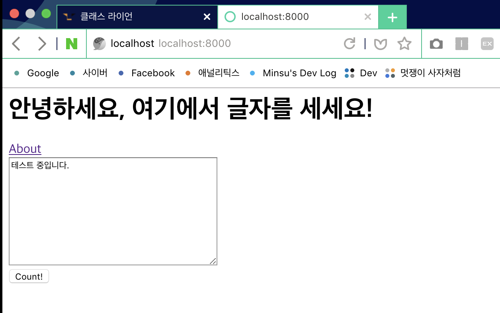
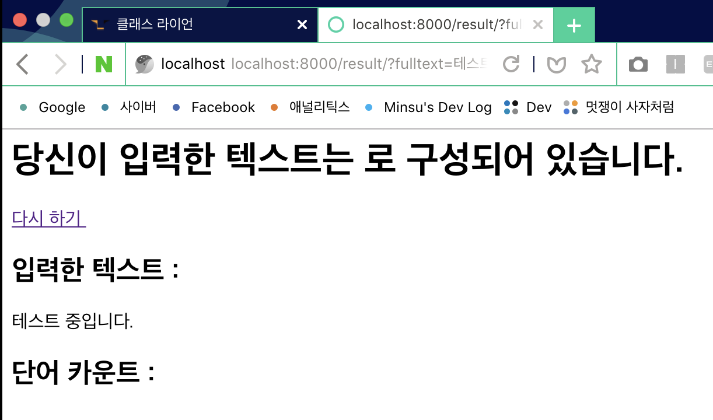
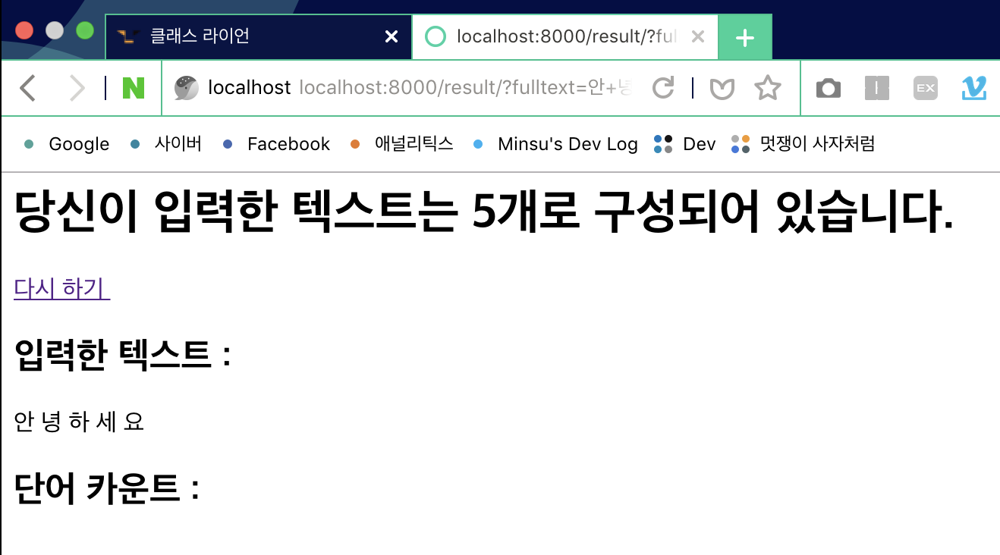

### 2주차 - 1.wordcount 이론

#### 유의사항
1. 서로서로 질문하자!<br/>
2. 질문을 **부끄러워** 하지 말자!

#### Word Count
긴 글을 입력했을 때 사용된 **단어의 수**를 반환하는 기능<br/>
해당 강의는 일단 `HTML`로만 구현<br/>
`HTML`은 디자인 하는 언어가 아니다.<br/>
`CSS`등으로 꾸미는 것은 각자 알아서.

#### 이용자의 눈으로 본 Wordcount
1. `home`에서 링크 클릭
    - About 페이지 출력

2. home에서 글 작성 후 제출 버튼 클릭
    - 글자의 개수가 출력

#### Django의 눈으로 본 Wordcount
1. 사용자가 처음 홈페이지에 들어온 경우
    - `home` 페이지 출력
2. 사용자가 링크를 클릭했을 경우
    - 미리 준비해논 `About` 페이지 출력
3. 사용자가 글을 작성한 후 제출 버튼 클릭
    - 사용자가 입력한 데이터를 함수로 처리한 후<br/>결과를 나타내는 페이지 출력

#### 우리가 만들어야 하는 HTML
1. home.html
    - 처음 들어왔을 때 보여지는 페이지
2. about.html
    - 정보를 보여주는 페이지
3. result.html
    - 결과를 보여주는 페이지

#### 각 페이지의 기능
**home.html**
1. `about`페이지와 링크로 연결
2. 사용자들로부터 입력 처리
3. 입력 받은 결과 제출 버튼

**about.html**
1. `home`페이지와 링크로 연결
2. `About`에 관한 정보 저장

**result.html**
1. `home`에서 입력받은 데이터를 처리할<br/>함수를 받아 결과 출력

#### 만들어야 하는 함수 (views.py)
**views.py**<br/>
**정보**를 **어떤** 상황에서 **어떻게** 처리할지 결정할 함수를 포함

정의할 함수
1. `home`을 띄우는 함수
    ```python
    def home(request):
        ...
        return render(request, home.html)
    ```
2. `about`을 띄우는 함수
    ```python
    def about(request):
        ...
        return render(request, about.html)
    ```
3. `result`에 전달할 함수
    - `home`에서 입력받은 데이터 처리 함수
    - 글자를 세 주는 함수

#### 만들어야 하는 URL
1. `home`을 띄우는 `url`
    - 뒤에 아무것도 붙지않는 `url`
2. `about`을 띄우는 `url`
    - 뒤에 `/about`이 붙는 `url`
3. `result`를 띄우는 `url`
    - 뒤에 `/result`가 붙는 `url`

#### 템플릿 언어
`HTML`안에 쓰는 `Django` 제공 언어<br/>
`HTML`안에 파이썬 변수/문법을 쓸 때 사용

**템플릿 변수**<br/>
```
{{python_variable}}
```
해당 파이썬 변수(`python_variable`)를 `HTML`파일에 담아 출력

**템플릿 필터**<br/>
```
{{python_value | filter}}
```
템플릿 변수에 추가적인 속성 및 기능 제공

예시<br/>
- value의 길이 반환
```
{{value | length}}
```
- value를 소문자로 출력
```
{{value | lower}}
```

**템플릿 태그**<br/>
```
 ... 
```
`HTML`상에서 파이썬 문법 사용<br/>
`url`생성 등의 기능 제공, **닫는 태그 필요**

**템플릿 태그 예시**<br/>
Python
```python
Aclass = ["민철", "철수", "영희"]
```

HTML
```html
number_of_students = {{class | length}}

    {{students}}

```

URL 생성
```html

```

**알아두면 좋은 것**<br/>
템플릿 상속 : [링크](http://rednooby.tistory.com/94)

<br/>

### 2주차 - 2.wordcount 실습 part 1
#### 1. 가상 환경을 켜고 시작
```
source myvenv/bin/activate
```

#### 2. Djnago 프로젝트 생성
```
django-admin startproject <project 이름>
```

#### 3. 프로젝트 경로 이동
```
cd <project 이름>
```

#### 4. App 생성
```
python manage.py startapp wordcount
```

#### 5. settings.py 에 App 추가
`INSTALLED_APPS`리스트에 `wordcount`앱 추가
```python
INSTALLED_APPS = [
    'django.contrib.admin',
    'django.contrib.auth',
    'django.contrib.contenttypes',
    'django.contrib.sessions',
    'django.contrib.messages',
    'django.contrib.staticfiles',
    'wordcount.apps.WordcountConfig',
]
```

#### 6. 템플릿 폴더 생성 및 템플릿 생성
`wordcount`앱 안에 `templates`폴더 생성<br/>
`templates`폴더 안에 `home.html`, `about.html`, `result.html` 생성

#### 7. views.py 에 함수 정의
`render(request, 템플릿 이름, 사전형 객체)`

`home`함수 정의
```python
def home(request):
    return render(request, 'home.html')
```

`about`함수 정의
```python
def about(request):
    return render(request, 'about.html')
```

#### 8. url 설계
1. `wordcount`앱에 `views.py` import
2. `urlpatterns`리스트에 `path`추가

```python
from django.contrib import admin
from django.urls import path
import wordcount.views

urlpatterns = [
    path('admin/', admin.site.urls),
    path('', wordcount.views.home, name="home"),
    path('about/', wordcount.views.about, name='about'),
]
```

#### 9. 페이지 연결
**템플릿 태그** 사용<br/>

`home.html`에 `about.html`연결
```
<a href="">About</a>
```

`about.html`에 `home.html`연결
```
<a href="">About</a>
```

<br/>

### 2주차 - 3.wordcount 실습 part 2
#### 1. result.html 파일 생성

#### 2. views.py 에 함수 정의
`result`함수 정의
```python
def result(request):
    return render(request, 'result.html')
```

#### 3. urls.py 에 path 추가
`urlpatterns`리스트에 `result`페이지 `path`추가
```python
urlpatterns = [
    path('admin/', admin.site.urls),
    path('', wordcount.views.home, name="home"),
    path('about/', wordcount.views.about, name='about'),
    path('result/', wordcount.views.result, name='result')
]
```

#### 4. result.html 과 home.html 연결
`home.html`의 `form`태그의 `action`옵션에<br/>
**템플릿 태그** 사용으로 `url`연결
```html
<form action="">
    ...
</form>
```

#### 5. 제출받은 데이터 처리
`home.html`에서 `textarea`태그의 이름인 `fulltext`를<br/>
`request`의 `GET`함수로 가져와 변수에 저장
```python
text = request.GET['fulltext']
```

`render`함수의 3번째 매개변수에 저장한 데이터 전달<br/>
`render`함수의 3번째 매개변수는 **사전형** 자료형(**딕셔너리**)
```python
def result(request):
    text = request.GET['fulltext']
    return render(request, 'result.html', {'full': text})
```

`result.html`에 **템플릿 변수**를 사용해 파이썬의 변수 사용<br/>
**템플릿 변수**의 이름은 매개변수로 준 **딕셔너리**의 **key**값
```html
<h2> 입력한 텍스트 : </h2>
{{ full }}
```

#### 테스트 이미지<br/>
**입력**<br/>


**출력**<br/>


#### 6. 저장한 문자열 자르기
`문자열`에서 `단어`는 **공백**을 기준<br/>
`split`함수 사용해 문자열 가공 후<br/>
`len`함수를 매개변수로 전달해 단어의 개수 전달
```python
def result(request):
    text = request.GET['fulltext']
    words = text.split()

    return render(request, 'result.html',
                  {'full': text,
                   'total': len(words),
                   })
```
템플릿 변수를 사용해 총 단어의 개수 `result.html`에 출력
```html
<h1>당신이 입력한 텍스트는 {{ total }}개로 구성되어 있습니다.</h1>
```

**테스트 이미지**<br/>


### 7. 단어 개수 세기
**사전형 자료형** 사용<br/>
**딕셔너리**에 단어가 있는 경우 개수 **1 증가**<br/>
단어가 없는 경우 **딕셔너리**에 단어 추가<br/>
모든 데이터 처리 후 `result.html`에 **딕셔너리** 아이템 전달
```python
words_dic = {}

for word in words:
    if word in words_dic.keys():
        # Increase word count
        words_dic[word] += 1

    else:
        # Add to dictionary
        words_dic[word] = 1

return render(request, 'result.html',
              {'full': text,
               'total': len(words),
               'dictionary': words_dic.items(),
               })
```

**테스트 이미지**<br/>


#### 8. 단어 개수 result 페이지에 출력
**템플릿 태그** 사용<br/>
`for loop`을 사용하면서 **딕셔너리**의<br/>
`key(단어)` : `item(개수)` 형식으로 출력

```html
<h2> 단어 카운트 : </h2>

    {{ word }} : {{ count }}<br/>

```

**테스트 이미지**<br/>


<br/>

### 2.5주차 - Git
**개발자**로서 `Git`을 다루는 능력은 필수<br/>
명령어가 **어떤 기능을 하는지**만 알고가자

#### Git
분산 버전 관리 시스템<br/>
1. 내 코드를 저장해주고
2. 이전 상태로 되돌려주고
3. 여럿이 같이 개발할 수 있게 해줌

#### Github
`Git`을 이용한 **오픈소스** 저장소<br/>

오픈소스
> (저작자의 권리는 인정하는) 너, 나, 우리의 코드

#### Git - Basic
프로젝트 작업 공간 ➤ Staging Area<br/>
`Add` 한다.<br/>

Staging Area ➤ Repository(저장소)<br/>
`Commit` 한다.

**Commit**
> 저장소의 Check point 어떤 변경사항들이 저장되었는지 기록

#### 명령어 정리
`Git` 저장소 초기화 (프로젝트 초기에 한 번만)
```
$ git init
```

저장소 상태 체크, 현재 프로젝트 변경사항 확인
```
$ git status
```

모든 파일을 staging area로 올리기
```
$ git add .
$ git add -A
$ git add --all
```

특정 파일을 staging area로 올리기
```
$ git add <file name>
```

저장소로 `commit` 하기
```
$ git commit -m <comment>
```

로컬 Repository ➤ 온라인 Repository
```
$ git remote add origin <깃헙 주소>
$ git push (-u origin master)
```

#### gitignore
`Git`에 올리고 싶지 않은 것들을 미리 필터링


#### 추가로 알면 좋은 것
협업을 위한 도구로서의 `Git`<br/>
ex) branch, merge...
