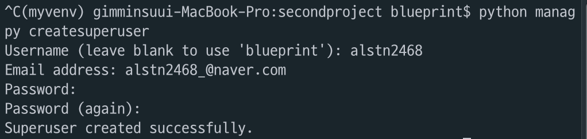
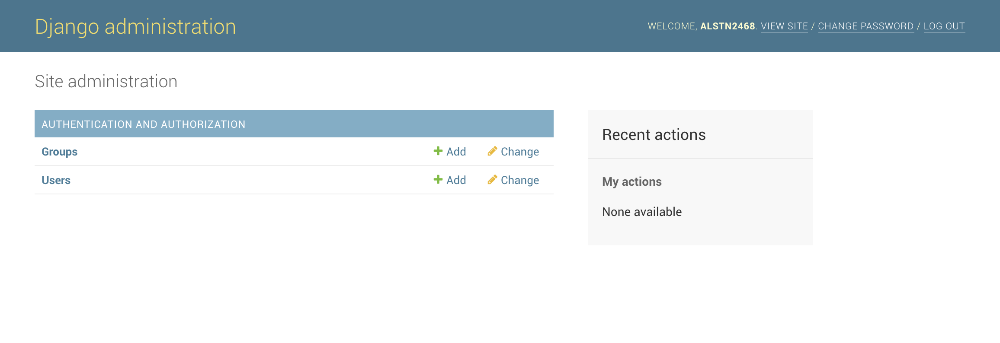

### 3주차 - 1.model&admin 이론

#### 학습목표
`Model`에 데이터를 **어떻게** 담을 것 인가?<br/>
`Model`의 데이터를 **어떻게** `View`로 넘길 것인가?<br/>
데이터를 **어떻게** 화면에 띄울 것인가?

#### 선행지식
**Python - Class**

#### 데이터베이스를 다루는 Model
처리할 데이터의 형식을 `model.py`에 `class`로 정의<br/>

- `model.py` : 데이터를 만드는 공장
- `class` : 데이터 처리 방법

`model.py`에 `class`만 정의한다고 끝난 것이 아니다.<br/>
`DataBase` = 정보 저장 공간, `DataBase`는 장고와 별개<br/>
`Django`의 `model`안에 정의한 `class`를 `DataBase`에 알려줘야 한다.

**사용되는 명령어**

`DataBase`가 알도록 하는 과정
```
$ python manage.py makemigrations
```

`DataBase`에 적용하는 과정
```
$ python manage.py migrate
```

#### 127.0.0.1/admin
`admin`계정 생성 명령어
```
$ python manage.py createsuperuser
```
`admin.py`에 들어가 데이터 등록

#### 한 줄 요약
`DataBase`에 **어떻게** 생긴 데이터를 넣을지 **정의**하고,<br/>
거기에 `admin`권한으로 **데이터**를 **저장**(= 글 쓰기)

<br/>

### 3주차 - 2.model&admin 실습

#### 1. 새로운 Django 프로젝트 생성
```
$ django-admin startproject <project 이름>
```

#### 2. 새 프로젝트 App 생성
```
$ python manage.py startapp <app 이름>
```

#### 3. settings.py에 App 추가
`INSTALLED_APPS`리스트에 앱 추가
```python
INSTALLED_APPS = [
    'django.contrib.admin',
    'django.contrib.auth',
    'django.contrib.contenttypes',
    'django.contrib.sessions',
    'django.contrib.messages',
    'django.contrib.staticfiles',
    'blog.apps.BlogConfig',
]
```

#### 4. 처리할 데이터를 models.py에 정의
`class`를 사용하여 정의<br/>
- `models.CharField()` : 짧은 문자열<br/>
- `models.DateTimeField()` : 날짜와 시간을 나타내는 데이터<br/>
- `models.TextField()` : 긴 문자열<br/>

```python
class Blog(models.Model):
    title = models.CharField(max_length=200)
    pub_date = models.DateTimeField('date published')
    body = models.TextField()
```

#### 5. 작성한 model을 DataBase에 적용
작성한 `model`을 `DataBase`에 적용하는 명령어
```
$ python manage.py makemigrations
```

실제로 `migrate`를 하는 명령어
```
$ python manage.py migrate
```

**실행 결과**<br/>


#### 6. admin계정 생성
`admin`계정 생성 명령어
```
$ python manage.py createsuperuser
```

**실행 결과**<br/>
<br/>


#### 7. admin.py에 models.py에 정의한 Class 추가
1. `admin.py`에 `models.py`의 `class` 선언
```python
from .models import Blog
```

2. `class`를 `admin.py`에 등록
```python
admin.site.register(Blog)
```

최종 `admin.py` 코드

```python
from django.contrib import admin
from .models import Blog

admin.site.register(Blog)
```

**admin 사이트 실행 결과**<br/>


#### 8. Blog Object를 제목으로 설정
`class`내부에 `__str__`함수 정의
```python
class Blog(models.Model):
    title = models.CharField(max_length=200)
    pub_date = models.DateTimeField('date published')
    body = models.TextField()

    def __str__(self):
        return self.title
```


